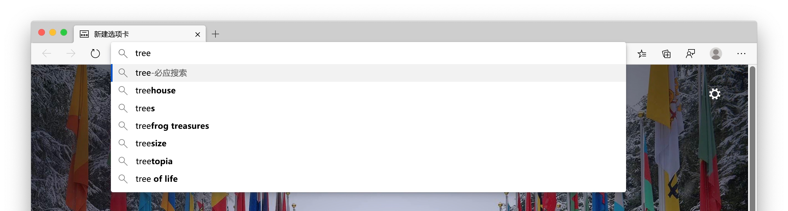
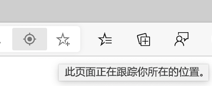
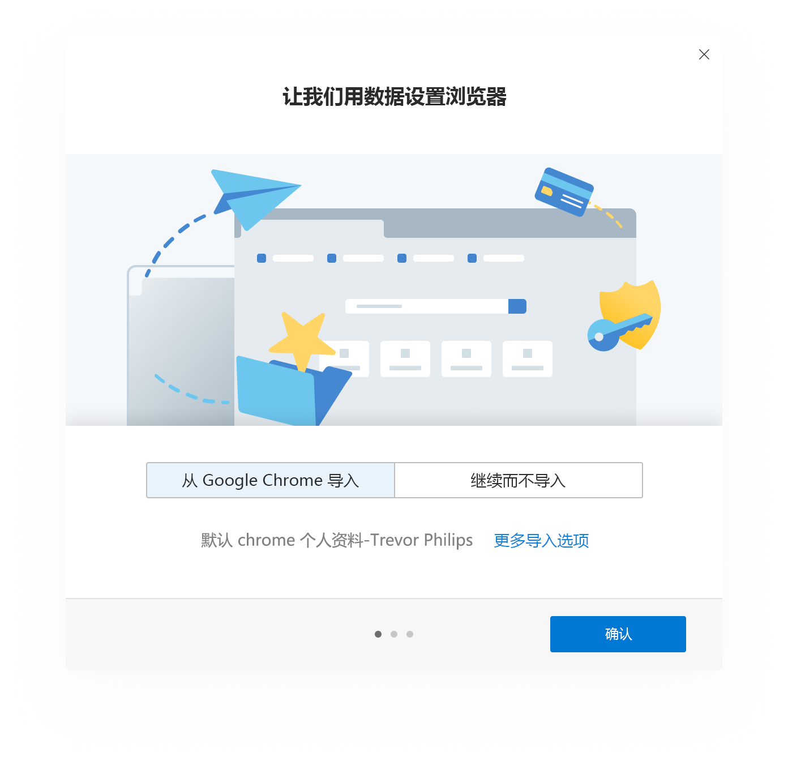
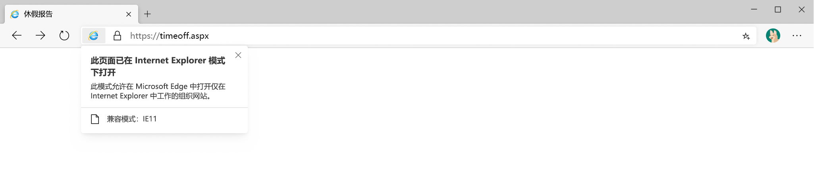
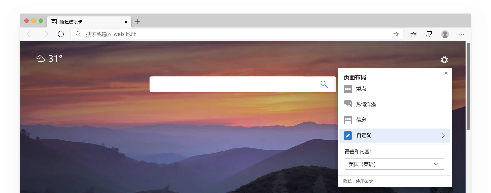
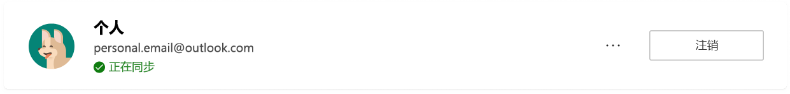
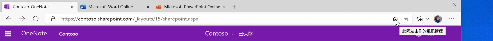

# Microsoft Edge 隐私白皮书Microsoft Edge Privacy Whitepaper  

我们的浏览器隐私承诺为您提供您可以获得的保护、透明度、控制和尊重。Our browser privacy promise is to provide you with the protection, transparency, control and respect you deserve.  为保持承诺以向 Microsoft 产品提供透明度，Microsoft Edge 团队提供了一个隐私声明，该白皮书介绍 Microsoft Edge 功能和服务的工作原理以及每种功能对您的隐私有何影响。To uphold commitments to give you transparency into Microsoft products, the Microsoft Edge team provided a privacy whitepaper that explains how Microsoft Edge features and services work and how each may affect your privacy.  Microsoft Edge 团队的目标是让你完全了解如何使用数据、如何控制不同功能，以及如何管理所收集的数据，以便你拥有为你做出正确的隐私决策所需的信息。The goal of the Microsoft Edge team is to give you a full understanding into how your data is used, how to control the different features, and how to manage your collected data, so you have the info you need to make the right privacy decisions for you.  

在纸张的某些部分中，Microsoft 团队提供了转到 Microsoft Edge 设置和其他页面的步骤。In certain sections of the paper, the Microsoft Team provide steps to go to Microsoft Edge settings and other pages.  为了保持一致性，Microsoft edge 团队在整个白皮书中使用了一种简写格式：你应该看到以`edge://`如下方式`edge://favorites`开头`edge://settings/privacy`或的 url。For consistency, the Microsoft edge team used a shortened format throughout the whitepaper: You should see URLs that begin with `edge://` such as `edge://favorites` or `edge://settings/privacy`.  若要转到页面，请直接在 Microsoft Edge 地址栏中键入粗体文本。To go to the pages, type the bolded text directly into the Microsoft Edge address bar.  这些页面仅可在 Microsoft Edge 中查看。These pages are only be viewable in Microsoft Edge.  

白皮书重点介绍 Microsoft Edge 的桌面版本，部分内容可能包括并非所有用户都提供的功能或体验。The whitepaper focuses on the desktop version of Microsoft Edge, and parts of the paper may include features or experiences that are not available for all users.  此外，白皮书还讨论当前产品中存在的功能和服务，但将来可能会发生更改。In addition, the whitepaper discusses features and services that exist in the product today, but may be subject to change in the future.  Microsoft 实践数据收集的 "最小化"，这意味着你的数据将保留最少的时间，但保留时间可能会有所不同，具体取决于所使用的功能或服务，并且可能会随着时间的推移而变化。Microsoft practices data collection minimization, which means your data is kept for the minimum amount of time, but retention times may vary depending on the feature or service being used and may change over time.  

## 地址栏和建议Address bar and suggestions  

地址栏允许您输入网站 Url 和搜索网页。The address bar allows you to enter website URLs and search the web.  默认情况下，地址栏使用您键入的字符提供搜索和网站建议。By default, the address bar provides search and site suggestions using the characters you type.  你应看到来自你的收藏夹、浏览历史记录、以前的搜索和默认搜索提供程序的建议。You should see suggestions from your favorites, browsing history, previous searches, and default search provider.  

  

为了使浏览和搜索更快，在地址栏中键入时，键入的字符将发送到您的默认搜索提供程序，以供搜索提供程序发送回建议的搜索查询。To make browsing and searching faster, as you type in the address bar, the typed characters are sent to your default search provider for the search provider to send back suggested search queries.  地址栏将你的条目分类为 URL、搜索或未知。The address bar categorizes your entry as a URL, search, or unknown.  此信息以及你选择的建议、所选内容的位置以及其他地址栏数据将发送到你的默认搜索提供程序。This information, along with which suggestion you select, position of selection, and other address bar data is sent to your default search provider.  你的浏览器唯一的 resettable 标识符，你的设备和其他服务标识符的唯一标识符将随此数据一起发送，以了解搜索查询和查询会话。A resettable identifier unique to your browser, an identifier unique to your device and other service identifiers are sent with this data to understand the search query and query session.  您的 IP 地址和 cookie 将发送到您的默认搜索提供商以增加搜索结果的相关性。Your IP address and cookies are sent to your default search provider to increase the relevance of the search results.  当你选择地址栏时，将向你的默认搜索提供程序发送信号，以通知提供商准备提供建议。A signal is sent to your default search provider when you select the address bar, to signal to the provider to get ready to provide suggestions.  除非您的搜索提供商是必应，否则不会向 Microsoft 发送键入的字符和搜索查询。The typed characters and search queries are not sent to Microsoft unless your search provider is Bing.  如果你拥有打开的 "我的键入字符" 设置的 "**显示我的搜索和网站建议**"，则仅将此数据发送到默认搜索提供程序。This data is only sent to your default search provider if you have the **Show me search and site suggestions using my typed characters** setting turned on.  关闭此功能将阻止键入的字符发送到默认的搜索提供程序。Turning off this feature stops your typed characters from being sent to the default search provider.  你的搜索查询仍将发送到你的默认搜索提供程序，以提供搜索结果。Your search queries are still sent to your default search provider to provide search results.  如果 Microsoft Edge 检测到你在地址栏中键入内容可能包含敏感信息（如身份验证凭据、本地文件名或通常加密的 URL 数据），则不会发送键入的文本。If Microsoft Edge detects that your typing in the address bar may contain sensitive information, such as authentication credentials, local file names, or URL data that is normally encrypted, it does not send the typed text.  如果你已**通过发送崩溃报告和有关如何使用浏览器设置的数据来改进 microsoft 产品**，microsoft Edge 将收集有关地址栏的诊断数据，例如提供多少个查询，而与你的搜索提供商无关。If you have **Improve Microsoft products by sending crash reports and data about how you use the browser** setting turned on, Microsoft Edge collects diagnostic data about the address bar, such as how many queries were offered, regardless of your search provider.  

击键和您访问的网站将存储在每个配置文件的设备本地。Keystrokes and the websites you visit are stored locally on the device per profile.  您可以在中`edge://settings/clearBrowserData`删除这些数据，选中 "**浏览历史记录**" 复选框，然后选择 "**立即清除**"。You may delete this data in `edge://settings/clearBrowserData`, selecting the check box for **Browsing history**, and selecting **Clear now**.  如果 "必应" 是你的默认搜索提供程序，并且你已登录 Bing，则可以通过[Microsoft 隐私仪表板](https://account.microsoft.com/account/privacy?ref=privacy-edge-browse&ru=https%3A%2F%2Faccount.microsoft.com%2Fprivacy%2Fbrowse%3Fref%3Dprivacy-edge-browse&destrt=privacy-dashboard)删除搜索。If Bing is your default search provider and you are signed in-to Bing, you may delete your searches through the [Microsoft privacy dashboard](https://account.microsoft.com/account/privacy?ref=privacy-edge-browse&ru=https%3A%2F%2Faccount.microsoft.com%2Fprivacy%2Fbrowse%3Fref%3Dprivacy-edge-browse&destrt=privacy-dashboard).  你可以清除中`edge://history`的浏览历史记录，以删除这些网站，使其在地址栏中显示为 "建议"。You may clear your browsing history in `edge://history` to delete those websites from appearing as suggestions in the address bar.  在 Windows 10 上，你可以通过转到 "**开始** > **设置** > **隐私** > **诊断 \ & 反馈**"，然后在 "**删除诊断数据**" 下选择 "**删除**"，清除 Microsoft 从地址栏收集的数据和搜索建议功能。On Windows 10, you may clear the data Microsoft collects from the address bar and search suggestions features by going to **Start** > **Settings** > **Privacy** > **Diagnostics \& feedback**, and selecting **Delete** under **Delete diagnostic data**.  所有其他数据将在36个月后删除。All other data is deleted after 36 months.  

如果你使用 Microsoft 工作或学校帐户登录到 Microsoft Edge，并且可以使用 Microsoft Search，则会向该查询发送一个表示你的帐户的匿名令牌，以提供特定于你公司的特定于帐户的功能，例如特定于你的公司的结果。If you are signed into Microsoft Edge with a Microsoft work or school account, and Microsoft Search is available, an anonymized token representing your account is sent with the query to provide account-specific functionality such as results specific to your company.  

所有数据通过 HTTPS 进行安全传输。All data is transmitted securely over HTTPS.  如果 "[必应](https://bing.com)" 是你的默认搜索提供程序，则搜索和类型字符将保存多达6个月。If [Bing](https://bing.com) is your default search provider, the searches and types characters are saved for up to 6 months.  

如果在 "地址" 框中搜索单个字词，Microsoft Edge 可能会将此字词发送到 DNS 服务器，以查看它是否对应于您的网络上的主机，并且可能会尝试连接到相应的主机。If you search for a single word in the address box, Microsoft Edge may send this word to your DNS server to see whether it corresponds to a host on your network, and may try to connect to the corresponding host.  这为你提供了导航到该主机的选项，而不是搜索。This gives you the option to navigate to that host instead of searching.  例如，如果你的路由器按`router`主机名进行操作，然后`router`在地址栏中键入，你将获得导航到`https://router/`的选项，以及使用默认搜索提供程序搜索该`router`单词。For example, if your router goes by the hostname `router` and you type `router` in the address bar, you are given the option to navigate to `https://router/`, as well as to search for the word `router` with your default search provider.  此功能不受使用 "我的键入字符" 设置的 "**显示我的搜索和网站建议**" 的控制，因为它不涉及将数据发送到默认搜索引擎。This feature is not controlled by the **Show me search and site suggestions using my typed characters** setting since it does not involve sending data to your default search engine.  

可以使用 "键入的字符" 设置关闭 "**显示我的搜索和网站建议**" 设置，并在中`edge://settings/search`更改默认搜索引擎。You may turn off the **Show me search and site suggestions using my typed characters** setting and change your default search engine in `edge://settings/search`.  在浏览 InPrivate 或以来宾模式浏览时，autosuggestions 处于关闭状态。While browsing InPrivate or in Guest mode, autosuggestions are turned off.  InPrivate 显示来自本地浏览的建议，如浏览历史记录或过去的搜索，但不会向默认搜索引擎发送任何键入的字符。InPrivate shows suggestions from your local browsing such as browsing history or past searches, but no typed characters are sent to your default search engine.  来宾模式不会显示任何建议，也不会向你的默认搜索引擎发送键入的字符。Guest mode does not display any suggestions or send typed characters to your default search engine.  

其他搜索提供商收集的数据遵循其公司的隐私策略。Data collected by other search providers follow the privacy policy of their company.  

## 自动填充Autofill  

Microsoft Edge 中的自动填充可让你保存密码、支付信息、地址和其他表单输入数据，从而帮助你提高工作效率。Autofill in Microsoft Edge helps you be more productive by letting you save passwords, payment info, addresses, and other form entry data.  当您访问网站并开始填写表单时，Microsoft Edge 使用表单填写信息将已保存的自动填充数据与窗体相匹配。When you visit a site and start to fill out a form, Microsoft Edge uses form fill info to match your saved autofill data to the form.  Microsoft Edge 提供了您在遇到类似窗体时以前保存的表单输入数据。Microsoft Edge offers form entry data you previously saved when you encounter similar forms.  密码和信用卡信息仅与你的每个密码和卡的显式权限一起保存。Passwords and credit card info are only saved with your explicit permission for each password and card.  

默认情况下，将保存地址和其他表单条目。Addresses and other form entries are saved by default.  但是，你可能会在中`edge://settings/addresses`关闭地址和其他表单数据的保存和自动填充。However, you may turn off saving and autofill of address and other form data in `edge://settings/addresses`.  

通过关闭中`edge://settings/passwords`的 "**保存密码**" 设置，防止 Microsoft Edge 提示您保存密码。Prevent Microsoft Edge from prompting you to save passwords by turning off the **Offer to save passwords** setting in `edge://settings/passwords`.  如果你不希望 Microsoft Edge 自动填充现有保存的密码，你可以删除中保存的`edge://settings/passwords`密码以删除所有自动填充数据。请转到 Microsoft Edge 隐私和服务设置中的 "**清除浏览数据**" 设置。If you do not want Microsoft Edge to autofill existing saved passwords, you may delete your saved passwords in `edge://settings/passwords`  To delete all autofill data go to the **Clear browsing data** setting in Microsoft Edge Privacy and services settings.  选择 "自动**填充表单数据**"，选择所需的时间范围，然后**清除 "立即清除**"。Select **Autofill form data**, the desired time range and then **Clear now**.  

如果你已为你的配置文件启用同步，则自动填充数据将在你登录到同一凭据的所有 Microsoft Edge 版本之间同步。If you have turned on sync for your profile, your autofill data is synced across all versions of Microsoft Edge where you are signed into the same credentials.  启用同步时，所有自动填充数据均存储在加密的 Microsoft 服务器上。When sync is turned on, all autofill data is stored on encrypted Microsoft servers.  存储在 Microsoft 服务器上的自动填充数据仅用于同步用途。The autofill data stored on Microsoft servers is only used for sync purposes.  你可以在中`edge://settings/profiles/sync`关闭自动填充数据的同步。You may turn off syncing of your autofill data in `edge://settings/profiles/sync`.  如果你为 "自动填充" 启用了同步，从你登录到 Microsoft Edge 的设备中删除自动填充数据将从你登录的其他设备中删除自动填充数据。If you turned on sync for autofill, deleting autofill data from a device where you are signed into Microsoft Edge removes the autofill data from other devices where you are signed-in.  

当你访问网页并提交表单时，Microsoft Edge 会发送有关窗体的信息，例如主机名和自动填充条目类型的哈希值 \ （例如，box 1 正在查找电子邮件地址，框2正在查找密码，依此类推 \）到 Microsoft 表单填写服务。When you visit a webpage and submit a form, Microsoft Edge sends info about the form such as a hash of the hostname and autofill entry types \(for example, box 1 is looking for an email address, box 2 is looking for a password, and so on\) to the Microsoft form fill service.  不会向服务发送任何用户输入的信息或用户标识符。No user-entered info or user identifiers are sent to the service.  此信息可帮助 Microsoft Edge 正确标识不同网页上的表单。This info helps Microsoft Edge correctly identify forms across different webpages.  此数据用于帮助将保存的自动填充数据与窗体匹配。This data is used to help match your saved autofill data to the form.  

使用来宾模式时，自动填充不可用，并且不会添加新的自动填充条目。When you use guest mode, autofill is not available and new autofill entries are not added.  浏览 InPrivate 时，Microsoft Edge 会提供自动填充条目，但不会添加新的自动填充条目。When you browse InPrivate, Microsoft Edge offers autofill entries, but new autofill entries are not added.  

## 为Cast  

Microsoft Edge 中的 "强制转换" 允许您使用 Google Cast 将媒体显示到另一个屏幕。Cast in Microsoft Edge allows you to display your media to another screen using Google Cast.  您可以从 "设置"**和 "更多（...）** " 访问此功能。 > **更多工具** > **将媒体转换为设备**。You may access this feature from **Settings and more (...)** > **More tools** > **Cast media to device**.  强制转换不使用任何 Microsoft 或 Google 服务。Cast does not use any Microsoft or Google services.  

## 集锦Collections  

您可以收集 web 上的网站、文本和图像，并在 Microsoft Edge 中用集合组织内容。You may collect sites, text and images on the web, and organize the content with Collections in Microsoft Edge.  所有集合数据都存储在设备上，并按 Microsoft Edge 配置文件进行组织。All collections data is stored locally on the device and organized per Microsoft Edge profile.  如果已为集合打开同步，则创建的集合（包括任何注释或注释）在所有登录和同步版本的 Microsoft Edge 中均可用。If you have sync turned on for Collections, your collections created, including any notes or comments, are available across all signed-in and syncing versions of Microsoft Edge.  

Microsoft Edge 每天24小时下载支持的网站的列表，其中存在特殊的实体提取模板。Every 24 hours Microsoft Edge downloads a list of supported sites for which special entity extraction templates exists.  模板特定于每个网站。The templates are specific to each website.  在你的集合中创建新项目时，Microsoft Edge 会验证你创建新集合项目的网站是否位于支持的网站列表中。When you create a new item in your collection, Microsoft Edge verifies that the site from which you are creating the new collection item is on the list of supported sites.  如果网站位于列表中，则 Microsoft Edge ping 特定网站模板的实体提取服务。If the site is on the list, Microsoft Edge pings the entity extraction service for the specific sites template.  没有与此服务请求相关联的用户标识符。No user identifiers are associated with this request to the service.  此模板将尝试识别有关正在收集的项目的名称、价格、评分、主图像和其他数据。This template attempts to identify the name, price, ratings, primary image, and other data about the item being collected.  如果您要从中创建新集合项的网站不在受支持的列表网站上，Microsoft Edge 不会下载模板。If the site from which you are creating a new collection item is not on the supported list site, Microsoft Edge does not download a template.  这些模板支持在设备上本地创建所有集合项。The templates enable all collection items to be created locally on the device.  不会将有关集合项的数据发送到服务以创建集合。No data about the collection items are sent to the service to create the collection.  

通过清除中`edge://settings/privacy`的 "**清除浏览数据**" 设置下的缓存数据，可以删除设备上存储的模板。The templates stored on the device may be deleted by clearing the cache data under the **Clear browsing data** setting in `edge://settings/privacy`.  

使用 InPrivate 浏览或来宾模式时，集合不可用。Collections is not available when using InPrivate browsing or Guest mode.  

## 崩溃Crashes  

如果启用了可选诊断数据（包括崩溃报告），Microsoft 将在 Microsoft Edge 崩溃或遇到其他可靠性问题时收集诊断数据。If optional diagnostic data including crash reports are turned on, Microsoft collects diagnostic data when Microsoft Edge crashes or encounters other reliability problems.  此诊断数据用于诊断和修复 Microsoft Edge 和其他 Microsoft 产品和服务的可靠性问题。This diagnostic data is used to diagnose and fix reliability problems of Microsoft Edge and other Microsoft products and services.  

  

收集的诊断数据采用故障转储的形式，其中包含在 Microsoft Edge 遇到可靠性问题时捕获的设备和软件状态。The diagnostic data collected is in the form of crash dumps, which contains device and software state captured at the time Microsoft Edge encountered the reliability problem.  故障转储包含有关在可靠性问题时所发生的情况的信息。The crash dump contains information about what was happening at the time of the reliability problem.  此诊断数据中可能包含您在崩溃时访问的网站或 CPU 使用率等信息。Information such as the website you were visiting at the time of the crash or your CPU usage may be included in this diagnostic data.  崩溃诊断数据将存储在设备上，并在崩溃报告打开时通过加密链接发送给 Microsoft。The crash diagnostic data is stored locally on the device and sent to Microsoft via an encrypted link when crash reporting is turned on.  每个崩溃转储都包含你的设备唯一的标识符、你的浏览器唯一的 resettable 标识符和额外的诊断数据 \ （如 URL、CPU 使用情况和网络使用情况 \）以帮助识别问题。Each crash dump contains an identifier unique to your device, a resettable identifier unique to your browser and extra diagnostic data \(such as the URL, CPU usage, and network usage\) to help identify the problem.  此额外的诊断数据将附加到故障转储，以帮助诊断可靠性问题，例如了解有多少设备遇到问题和严重性。This extra diagnostic data is attached to the crash dump to help diagnose the reliability problem, such as understanding how many devices are encountering the problem and the severity.  

故障转储将发送到 Microsoft 并存储在最多30天的安全的 Microsoft 服务器上，然后删除。Crash dumps are sent to Microsoft and stored on secure Microsoft servers for up to 30 days and then deleted.  请求要在 Windows 10 设备上删除此诊断数据，请转到**启动** > **设置** > **隐私** > **诊断 \ & 反馈**，然后选择 "**删除诊断数据**" 设置下的 "**删除**"。Request to delete this diagnostic data on Windows 10 devices by going to **Start** > **Settings** > **Privacy** > **Diagnostics \& feedback** and selecting **Delete** under the **Delete diagnostic data** setting.  用于报告和产品改进的聚合崩溃信息（如出现的崩溃类型数）将存储。Aggregated crash information such as a count of types of crashes occurring are stored for reporting and product improvement purposes.  

本地存储在设备上的崩溃诊断数据可能会从文件系统中`edge://crashes`清除。Crash diagnostic data stored locally on the device may be cleared from the file system in `edge://crashes`.  

若要在 Windows 10 上关闭崩溃诊断数据收集，请转到**诊断 \ &** windows 诊断 \ & 反馈设置中的反馈。To turn off crash diagnostic data collection on Windows 10, go to **Diagnostics \& feedback** in Windows Diagnostics \& feedback settings.  对于所有其他平台上的 Microsoft Edge 版本，请`edge://settings/privacy`转到 "**通过发送崩溃报告和有关使用浏览器**设置的数据" 来关闭改进 Microsoft 产品。For versions of Microsoft Edge on all other platforms go to `edge://settings/privacy` and turn off the **Improve Microsoft products by sending crash reports and data about how you use the browser** setting.  也可以通过[您的组织管理的组策略](/deployedge/microsoft-edge-privacy-policy)为企业关闭此诊断数据收集。This diagnostic data collection may also be turned off for enterprises through [group policies managed by your organization](/deployedge/microsoft-edge-privacy-policy).  

## 有关如何使用浏览器的诊断数据Diagnostic data about how you use the browser  

Microsoft 使用诊断数据改进我们的产品和服务，让我们的产品保持安全并保持最新状态，帮助我们更好地了解我们的产品如何执行。Microsoft uses diagnostic data to improve our products and services, keep our products secure and up to date, and help us better understand how our products are performing.当 Microsoft Edge 团队收集数据时，将验证决策是否适合你。 Whenever the Microsoft Edge team collect data, the decision is verified as the right choice for you.  Microsoft 的 "相信" 和 "做法信息收集" 最佳做法。Microsoft believes in and practices information collection minimization.  Microsoft Edge 团队致力于仅收集所需的信息，并且仅在需要时才存储这些信息，以便改进 Microsoft 产品和服务。The Microsoft Edge team strives to gather only the info that is needed and is stored only for as long as it is needed to improve Microsoft products and services.  

当你在 Microsoft Edge 和其他使用 Microsoft Edge web 平台的应用程序中使用功能和服务时，有关如何使用这些功能的诊断数据将发送给 Microsoft。As you use features and services in Microsoft Edge and other applications that use the Microsoft Edge web platform, diagnostic data about how you use those features is sent to Microsoft.  此诊断数据包括安装 Microsoft Edge、功能使用情况、性能和内存使用等信息。This diagnostic data includes information like your installation of Microsoft Edge, feature usage, performance, and memory usage.  例如，如果你喜欢某个网站，Microsoft Edge 团队将收到 "收藏夹" 按钮已被单击且已成功添加收藏夹的信息，但未将哪个网站设置为收藏项。For example, if you favorite a website, the Microsoft Edge team receives info that the favorite button was clicked and a favorite was successfully added, but not which site was set as a favorite.  此诊断数据还包括性能信息，例如打开新选项卡所花的毫秒数。 此白皮书中提及的功能和服务收集诊断数据。This diagnostic data also includes performance information, such as how many milliseconds it took to open a new tab.  The features and services mentioned in this whitepaper collect diagnostic data.  

  

此外，Microsoft Edge 将收集一组必需的诊断数据，以使产品保持最新状态，确保产品安全并正常运行。In addition, Microsoft Edge collects a set of required diagnostic data necessary to keep the product up to date, secure and performing properly.  这包括设备连接和有关当前数据收集同意设置、应用版本和安装状态的配置信息。This includes device connectivity and configuration information about the current data collection consent setting, app version, and installation state.  只有你的组织管理的组策略才能关闭此功能。This is only able to be turned off with group policies managed by your organization.  [了解有关您的组织中的诊断数据的详细信息](/windows/privacy/configure-windows-diagnostic-data-in-your-organization)。[Learn more about diagnostic data in your organization](/windows/privacy/configure-windows-diagnostic-data-in-your-organization).  

Microsoft Edge 生成此诊断数据并将其存储在本地，并定期将其发送给 Microsoft。Microsoft Edge generates this diagnostic data, stores it locally, and periodically sends it to Microsoft.  诊断数据通过 HTTPS 发送并存储在 Microsoft 服务器上。The diagnostic data is sent via HTTPS and stored on Microsoft servers.  此诊断数据与你的设备唯一的标识符以及你的浏览器唯一的 resettable 标识符相关联。This diagnostic data is associated with an identifier unique to your device and a resettable identifier unique to your browser.  标识符不包含您的个人信息。The identifiers do not contain your personal information.  若要在 Windows 10 设备上重置你的浏览器独有的标识符，请转到 "**开始** > **设置** > **隐私** > **诊断" & 反馈**，然后在 "**删除诊断数据**" 设置下选择 "**删除**"，或将 "从**完整**到**基本**的**诊断数据**" 设置为 "To reset the identifier unique to your browser on Windows 10 devices, go to **Start** > **Settings** > **Privacy** > **Diagnostics \& feedback** and select **Delete** under the **Delete diagnostic data** setting or change your setting under **Diagnostic data** from **Full** to **Basic**.  在其他平台上，每当您通过将 "**浏览器"** 设置`edge://settings/privacy`从 "开始" 设置为 **"** **关闭**" 时，你的浏览器的数据都将再次生成你的浏览器特有的 resettable 标识符。On other platforms, the resettable identifier unique to your browser is generated again whenever you change the **Improve Microsoft products by sending data about how you use the browser** setting in `edge://settings/privacy` from **on** to **off**.  对于使用组织设置的组策略管理的设备，此重置功能可能会有所不同。This reset functionality may be different for devices managed with group policies set by your organization.  

如果你使用的是 Windows 10 版本 1803 \ （2018更新 \）或更高版本，你可以在诊断数据查看器中通过转到 "**开始** > **设置** > **隐私** > **诊断" & 反馈**，并选择 "**查看诊断数据**" 设置下的 "**打开诊断数据查看器**" 来查看与 Microsoft 共享的产品数据。If you are using Windows 10 version 1803 \(April 2018 Update\) or above, you may view product data shared with Microsoft in the Diagnostic Data Viewer by going to **Start** > **Settings** > **Privacy** > **Diagnostics \& feedback** and selecting **Open Diagnostic Data Viewer** under the **View diagnostic data** setting.  

对于低于版本1803的其他平台或 Windows 10 版本，请转到`edge://data-viewer`查看此诊断数据。For other platforms or versions of Windows 10 lower than version 1803, go to `edge://data-viewer` to view this diagnostic data.  数据将定期发送到 Microsoft，并且`edge://data-viewer`仅显示自上次打开查看器以来已发送给 microsoft 的数据。Data is sent to Microsoft periodically, and `edge://data-viewer` only shows data that has been sent to Microsoft since the last time the viewer was opened.  你可能需要刷新查看器，以查看你的给定会话已向 Microsoft 发送了哪些数据。You might need to refresh the viewer to see what data has been sent to Microsoft for your given session.  用于填充`edge://data-viewer`的数据存储在设备上的本地。The data used to populate `edge://data-viewer` is stored locally on the device.  若要在查看器中清除此数据，只`edge://data-viewer`需关闭选项卡。To clear this data in the viewer, simply close the `edge://data-viewer` tab.  

诊断数据存储在 Microsoft 服务器上最多可达18个月。The diagnostic data is stored on Microsoft servers for up to 18 months.  在 Windows 10 中，你可以通过转到 "**删除诊断数据**" 设置下的 "**开始** > **设置** > **隐私** > **诊断" & 反馈**，然后选择 "**删除**" 来删除诊断数据。On Windows 10 you may delete the diagnostic data by going to **Start** > **Settings** > **Privacy** > **Diagnostics \& feedback** and selecting **Delete** under the **Delete diagnostic data** setting.  "删除诊断数据" 功能仅在 Windows 10 2018 更新和更高版本上受支持。The Delete diagnostic data functionality is only supported on Windows 10, April 2018 update and newer.  有关详细信息，请参阅[Windows 10 中的 "诊断"、"反馈" 和 "隐私"](https://support.microsoft.com/help/4468236/diagnostics-feedback-and-privacy-in-windows-10-microsoft-privacy)。For more information see [Diagnostics, feedback, and privacy in Windows 10](https://support.microsoft.com/help/4468236/diagnostics-feedback-and-privacy-in-windows-10-microsoft-privacy).  

对于 Windows 10 稳定和 Microsoft Edge Beta 频道，此设置由你的 Windows 诊断数据设置确定。For Windows 10 Stable and Beta channels of Microsoft Edge, this setting is determined by your Windows diagnostic data setting.  这会反映在 Microsoft Edge 隐私和服务设置中。This is reflected in your Microsoft Edge Privacy and services settings.  转到 "**开始** > **设置** > **隐私** > **诊断 \ & 反馈**"，更改此 Windows 设置。Change this Windows settings by going to **Start** > **Settings** > **Privacy** > **Diagnostics \& feedback**.  在所有其他频道和平台上，你可以在中`edge://settings/privacy`控制此诊断数据收集，并**通过发送崩溃报告和有关如何使用浏览器设置的数据来打开或关闭改进 Microsoft 产品**。On all other channels and platforms, you may control this diagnostic data collection in `edge://settings/privacy` and turning on or off the **Improve Microsoft products by sending crash reports and data about how you use the browser** setting.  对于与你的设备上的 Microsoft Edge 安装相关联的所有配置文件，此设置是相同的。This setting is the same for all profiles associated with the installation of Microsoft Edge on your device.  此设置不会在设备之间同步。This setting is not synced across devices.  该设置适用于 InPrivate 浏览和来宾模式。The setting applies to InPrivate browsing and Guest mode.  如果您的设备是使用由您的组织设置的组策略管理的， `edge://settings/privacy`则会反映在中。If your device is managed with group policies set by your organization, this is reflected in `edge://settings/privacy`.  

## 数字权利管理和媒体许可证Digital Rights Management and Media Licenses  

当网站提供受数字权限管理保护的媒体内容 \ （DRM \）时，Microsoft Edge 使用安全的播放管道确保内容不会被正确复制或访问。When a website offers media content that is protected by Digital Rights Management \(DRM\), Microsoft Edge uses a secure playback pipeline to ensure the content is not copied or accessed improperly.  作为此功能的一部分，Microsoft Edge 可能会在你的设备上存储与 DRM 相关的数据，包括唯一标识符和媒体许可证，并且可能会将该唯一标识符传输到内容提供商指定的媒体授权服务器。As part of this feature, Microsoft Edge may store DRM-related data on your device, including a unique identifier and media licenses, and may transmit that unique identifier to a media licensing server specified by the content provider.  使用该网站时，Microsoft Edge 将检索 DRM 信息，以确保你有权使用该内容。When you use the website, Microsoft Edge retrieves the DRM info to make sure you have permission to use the content.  此数据有助于验证对受保护内容的访问，并确保无缝媒体体验。This data helps to validate access to the protected content and ensure a seamless media experience.  

Microsoft Edge 通过针对 HTML5 网站的加密媒体扩展 API \ （EME API \）支持 DRM。Microsoft Edge supports DRM via the Encrypted Media Extensions API \(EME API\) for HTML5 sites.  EME API 允许网站与名为内容解密模块 \ （清洁 \）的 DRM 提供程序进行通信。The EME API allows websites to communicate with a DRM provider called a Content Decryption Module \(CDM\).  不同的 DRM 系统（如 Widevine 由 Microsoft 的 Google 或 PlayReady）可能受其自己的清洁实现支持。Different DRM systems, such as Widevine by Google or PlayReady by Microsoft, may be supported by their own CDM implementation.  内容提供商可以选择支持一个或多个可能的 DRM 系统，并且可以利用 EME API 的功能确定要用于特定客户端的 DRM 系统。Content providers may choose to support one or more potential DRM systems and may utilize the functionality of the EME API to decide which DRM system to use for a specific client.  [了解有关 EME 隐私的详细信息](https://w3.org/TR/encrypted-media/#privacy)。[Learn more about EME privacy](https://w3.org/TR/encrypted-media/#privacy).  

Microsoft Edge 仅在 Windows 10 上支持 PlayReady DRM。Microsoft Edge supports PlayReady DRM only on Windows 10.  PlayReady 是一种 DRM 实现，可提供4K 视频和杜比 Atmos 音频等媒体体验。PlayReady is an DRM implementation to deliver media experiences such as 4K video and Dolby Atmos audio.  Microsoft Edge 使用 Windows 平台媒体基础 Api 来支持 PlayReady。Microsoft Edge uses the Windows Platform Media Foundation APIs to support PlayReady.  为了验证对受保护内容的访问权限，Microsoft Edge 使用 Windows 10 操作系统，该操作系统使用唯一的标识符并通过 PlayReady 服务进行通信。To validate access to protected content, Microsoft Edge utilizes the Windows 10 operating system which uses a unique identifier and communicates that with the PlayReady service.  在设备上保留的 PlayReady 的所有 EME、清洁和浏览器数据将在 Microsoft Edge 上存储和维护。All EME, CDM, and browser data for PlayReady that persists on the device is stored and maintained on Microsoft Edge.  [了解有关 PlayReady 的详细信息](/playready/overview/simple-end-to-end-system)。[Learn more about PlayReady](/playready/overview/simple-end-to-end-system).  

Microsoft Edge 支持使用 Google DRM 的 Widevine，默认情况下，此选项处于打开状态。Microsoft Edge supports Widevine by Google DRM and this option is on by default.  Microsoft Edge 定期从 Google server 获取 Widevine 的更新。Microsoft Edge periodically fetches updates for Widevine from Google servers.  使用 Widevine 可能包括与 Google 的通信。The use of Widevine may include communications to Google.  用户可以通过禁用 Microsoft Edge 中的 Widevine DRM 标志退出使用 Widevine `edge://flags/#edge-widevine-drm`。Users may opt-out of using Widevine in Microsoft Edge by disabling the Widevine DRM flag in `edge://flags/#edge-widevine-drm`.  Widevine 具有创建唯一设备标识符并将其传输到 Google 的功能。Widevine has the capability to create a unique device identifier and transmit it to Google.  有关 Widevine 和隐私的更多特定信息，请参阅 Google 隐私策略。For more specific information on Widevine and privacy, see the Google privacy policy.  

Microsoft Edge 支持由 Adobe 使用的 Flash Access DRM，由某些网站而不是 HTML5 使用。Microsoft Edge supports the Flash Access DRM by Adobe, which is used by some sites instead of HTML5.  你必须授予允许 Adobe Flash 在网站请求时允许 Adobe Flash 的权限。You must give permission to allow Adobe Flash when a site requests it.  当网站使用 Adobe 的 Flash Access DRM 时，Microsoft Edge 将为 Adobe 提供对唯一设备标识符的访问权限。When a site uses the Flash Access DRM by Adobe, Microsoft Edge gives Adobe access to a unique device identifier.  你可以在中`edge://settings/privacy`清除和重置此标识符的任何本地存储的实例。You may clear and reset any locally stored instances of this identifier in `edge://settings/privacy`.  在 "**清除浏览数据**" 下，选择 "**选择要清除的内容**"，选中 " **cookie 和其他网站数据**" 复选框，然后选择 "**立即清除**" 以删除任何存储的标识符。Under **Clear browsing data**, select **Choose what to clear**, select the check box for **Cookies and other site data**, and select **Clear now** to remove any stored identifiers.  停止在`edge://settings/content/flash`其中使用 ADOBE Flash DRM。Stop Adobe Flash DRM from ever being used in `edge://settings/content/flash`.  

当您请求对诸如联机电影之类的加密 HTML5 媒体的访问权限时，Microsoft Edge 会创建一个许可证请求来解密媒体。When you request access to encrypted HTML5 media like an online movie, Microsoft Edge creates a license request to decrypt the media.  正在使用的清洁将创建包含请求 ID 的许可证请求。The CDM being used creates the license request that contains a request ID.  此请求将发送到许可证服务器。This request is sent to the license server.  许可证请求的任何部分均不包含任何个人身份信息，并且许可证请求未存储在设备上。No part of the license request contains any personally identifiable information, and the license request is not stored on the device.  

当返回媒体许可证时，将创建一个媒体标识符，该标识符对用户和网站是唯一的。When returning the media license, a media identifier is created which is unique to the user and the site.  此 ID 不会在网站之间共享，并且对于每个网站都是不同的。This ID is not shared between sites and is different for each site.  用于标识播放会话的会话 ID 与媒体标识符一起发送，用于解密媒体。A session ID, used to identify a playback session, is sent with the media identifier to decrypt the media.  媒体标识符存储在设备上的本地，并且可能与内容提供商存储在一起。The media identifier is stored locally on the device and may be stored with the content provider.  

所有 DRM 和内容保护均可在中`edge://settings/content/protectedContent`关闭。All DRM and content protections may be turned off in `edge://settings/content/protectedContent`.  

- 关闭 "**允许网站播放受保护的内容**" 设置将禁用基于清洁的 DRM 系统（如 PlayReady 和 Widevine）播放，但不适用于不基于清洁的系统（如 FLASH Access DRM）。Turning off the **Allow sites to play protected content** setting disables playback for CDM-based DRM systems such as PlayReady and Widevine, but not for non-CDM-based systems like Flash Access DRM.  Flash 由中`edge://settings/content/flash`的单独网站权限管理。Flash is managed by a separate site permission in `edge://settings/content/flash`.  关闭此设置会导致媒体功能停止正常工作。Turning off this setting causes media functionality to stop working properly.  
- 关闭 "**允许受保护内容的标识符**" 设置可阻止为 FLASH Access DRM 创建标识符，防止 Widevine 定期从 Google 提取更新。Turning off the **Allow identifiers for protected content** setting prevents the creation of identifiers for Flash Access DRM and prevents Widevine from periodically fetching updates from Google.  这可能会导致某些网站上的某些媒体功能停止正常工作。This may cause some media functionality on some sites to stop working properly.  

## 请勿跟踪Do Not Track  

当您打开 "发送时" 中`edge://settings/privacy`的 **"请勿跟踪" 请求**设置时，Microsoft Edge 会向您的传出 HTTP、HTTPS 和 SPDY 浏览流量请求发送一个 DNT： 1 http 标头，以请求每个网站不使用跟踪程序。When you turn on the **Send "Do Not Track" requests** setting in `edge://settings/privacy`, Microsoft Edge sends a DNT:1 HTTP header with your outgoing HTTP, HTTPS and SPDY browsing traffic requests to websites you visit to request that each does not use trackers.  但是，打开 "不**跟踪" 请求**设置不能保证网站无法跟踪您。However, turning on the **Send "Do Not Track" requests** setting does not guarantee that websites are not able to track you.  某些网站可能会通过向你显示不基于任何以前浏览的广告来接受此请求。Some sites might honor this request by showing you ads not based on any previous browsing.  如果此请求生效，Microsoft Edge 将不具有控制权。Microsoft Edge does not have control if this request is honored or not.  若要帮助防止网站跟踪你，请将**跟踪防护**设置更改`edge://settings/privacy`为 "已**平衡**" 或 "**严格**"。To help prevent websites from tracking you, change your **Tracking prevention** setting in `edge://settings/privacy` to **Balanced** or **Strict**.  

使用来宾模式时，Microsoft Edge 不会发送 "不跟踪" 请求。When you use guest mode, Microsoft Edge does not send "Do Not Track" requests.  使用 InPrivate 浏览时，如果已为你正在使用的配置文件启用 "**不跟踪" 请求设置，** Microsoft Edge 将仅发送 "不要跟踪" 请求。When you use InPrivate browsing, Microsoft Edge only sends "Do Not Track" requests if the **Send "Do Not Track" requests** setting is turned on for the profile you are using.  

## 下载Downloads  

Microsoft Edge 允许您安全、安全地下载文件。Microsoft Edge lets you download files safely and securely.  你可以选择在`edge://settings/downloads`设备上下载文件的位置。You may choose where files are downloaded on your device in `edge://settings/downloads`.  如果启用了 SmartScreen，有关文件（如文件名和 URL）的信息将发送到 SmartScreen 以检查文件的声誉。If SmartScreen is enabled, info about your file, such as the file name and URL, are sent to SmartScreen to check the reputation of the file.  这可帮助你避免意外下载已知的已知恶意软件，从而损害你的设备。This helps you avoid accidentally downloading known malware that is known to hurt your device.  您可以在中`edge://settings/privacy`打开或关闭 SmartScreen。You may turn on or off SmartScreen in `edge://settings/privacy`.  [了解有关 SmartScreen 的详细信息](#smartscreen)。[Learn more about SmartScreen](#smartscreen).  

可在中`edge://downloads`查看以前下载的历史记录。A history of your previous downloads may be viewed in `edge://downloads`.  在中`edge://settings/clearBrowserData`清除浏览数据可能会用于删除浏览数据，包括下载历史记录。Clearing your browsing data in `edge://settings/clearBrowserData` may be used to delete your browsing data, including your download history.  从 Microsoft Edge 删除下载历史记录不会从你的设备中删除文件。Deleting your download history from Microsoft Edge does not remove the files from your device.  从设备删除下载的文件不会从下载历史记录中删除文件。Deleting downloaded files from your device does not remove the files from your download history.  当你使用 InPrivate 浏览或来宾模式时，当你关闭 InPrivate 或来宾窗口时，将清除该会话的下载历史记录，但文件会保存在设备上。When you use InPrivate browsing or Guest mode, the download history from that session is cleared when you close the InPrivate or Guest windows, but the files are saved on the device.  

## 扩展和 Microsoft Edge AddonsExtensions and Microsoft Edge Addons  

你可以在 Microsoft Edge 中安装将功能添加到浏览器的扩展。You may install extensions in Microsoft Edge that add functionality to the browser.  从 Microsoft Edge Addons 或其他扩展存储安装扩展时，Microsoft 会收集有关这些扩展的信息，以帮助开发人员和 Microsoft 了解如何使用每个扩展。When you install an extension from Microsoft Edge Addons or another extension store, Microsoft collects information about the extensions to help developers and Microsoft understand how each is used.  Microsoft Edge 收集聚合数据，包括扩展已下载的次数以及有关其执行方式的信息，如崩溃数据。Microsoft Edge collects aggregated data including the number of times an extension has been downloaded and information about how it is performing, such as crash data.  Microsoft 与扩展的开发人员共享此聚合数据。Microsoft shares this aggregated data with the developers of the extensions.  来自用户的批注和评论在应用商店上是公共的，并且也与开发人员共享。Comments and reviews from users are public on the store and are also shared with the developers.  如果你已登录到 Microsoft Edge，则请求安装扩展包含 cookie，并且安装与你的帐户相关联。If you are signed into Microsoft Edge, requests to install extensions contain cookies and the installation is associated with your account.  此数据在聚合中用于了解扩展的普及程度。This data is used in aggregate to understand the popularity of extensions.  

如果你在配置文件设置中启用了扩展的同步，则这些扩展的扩展和首选项将同步到 Microsoft Edge 的所有登录同步版本。If you turned on sync for extensions in your profile settings, your extensions and preferences for those extensions are synced across all your signed-in syncing versions of Microsoft Edge.  

安装扩展是可选的，所有扩展可能会在任何时间卸载`edge://extensions`。Installing extensions is optional, and all extensions may be uninstalled at any time in `edge://extensions`.  扩展使用 Microsoft Edge 更新服务进行更新，该服务将已安装扩展的列表发送到更新服务，以检查是否有更新可用。Extensions are updated using the Microsoft Edge update service, which sends a list of the installed extensions to the update service to check if an update is available.  扩展安装时，扩展程序指定需要哪些用户数据才能访问，并且 Microsoft Edge 要求在安装扩展之前获得您的同意。At the time of an extension installation, extensions specify what user data is needed to access, and Microsoft Edge asks for your consent before installing the extension.  在安装之前，请始终确保扩展是可靠且安全的，并查看开发人员提供的该扩展的隐私策略。Always make sure an extension is credible and secure before installing it, and review the privacy policy for that extension provided by the developer.  

## 家庭安全Family safety  

Microsoft 提供了许多工具来帮助家庭保持连接，并使儿童在运行 Microsoft 启动器的 Windows 10、Xbox 和 Android 设备上更加安全。Microsoft offers a number of tools to help families stay connected and keep kids safer on Windows 10, Xbox, and Android devices running Microsoft Launcher.  

在家庭组中，在使用 Microsoft Edge 时，应该为儿童启用家庭设置。Within a family group, there are family settings that should be enabled for children while using Microsoft Edge.  家庭组组织者必须为组中的用户启用这些设置。The family group organizer must enable these settings for users in the group.  家庭组提供的三个主要功能是 web 筛选、活动报告和安全搜索。The three main features offered to a family group are web filtering, activity reporting, and safe search.  

Web 筛选可防止家庭组中的儿童转到由家庭组织者特别阻止的成熟网站或网站。Web filtering protects children in the family group from going to mature websites or websites specifically blocked by the family organizer.  

活动报告记录关于儿童访问的信息，以及搜索、屏幕时间、使用的设备和尝试访问阻止的网站。Activity reporting records info about the websites children visit, as well as searches, screen time, devices used, and attempts to visit blocked sites.  家庭组组织者可能会在[family.microsoft.com](https://family.microsoft.com)中看到此信息。The family group organizer may see this info at [family.microsoft.com](https://family.microsoft.com).  此数据在传输过程中进行收集、加密，并发送到 Microsoft 并存储在安全的 Microsoft 存储服务器上。This data is collected, encrypted in transit, and sent to Microsoft and stored on secure Microsoft storage servers.  此数据是利用孩子的 Microsoft 帐户收集的，因此它可以进行管理。This data is collected with the child's Microsoft account so it is able to be managed.  活动报表存储在[family.microsoft.com](https://family.microsoft.com)上最多30天，然后删除。Activity reports are stored on [family.microsoft.com](https://family.microsoft.com) for up to 30 days and then deleted after.  

安全搜索向搜索引擎的标题请求添加安全的关键字。Safe search adds a safe keyword to the header request to search engines.  Bing 读取此关键字并筛选返回到子元素的搜索结果。Bing reads this keyword and filters search results returned to the child.  其他搜索引擎也可能返回此关键字所导致的筛选结果。Other search engines may return filtered results due to this keyword as well.  将收集所有孩子的搜索并使其可供家庭组织者在活动报告或[family.microsoft.com](https://family.microsoft.com)中查看。All of the child's searches are collected and made available for the family organizer to view in activity reports or at [family.microsoft.com](https://family.microsoft.com).  此数据是利用孩子的 Microsoft 帐户收集的，因此它可能会被正确管理。This data is collected with the child's Microsoft account so it may be properly managed.  

孩子的浏览数据存储在 Microsoft 安全的服务器上，并且在30天内可供家长使用，然后立即被删除。The child's browsing data is stored on Microsoft-secured servers and made available to parents for up to 30 days, then immediately deleted.  可随时从[Microsoft 隐私仪表板](https://account.microsoft.com/account/privacy)中删除这些数据。This data may be deleted at any time from the [Microsoft privacy dashboard](https://account.microsoft.com/account/privacy).  在设备上本地存储的浏览数据必须在中从 Microsoft Edge 中`edge://settings/clearBrowserData`清除浏览数据。Browsing data stored locally on a device must be Clear browsing data from Microsoft Edge in `edge://settings/clearBrowserData`.  

孩子必须使用其 Microsoft 帐户登录到 Windows 10，并且 "活动报告" 设置必须由 "家庭管理器" 打开，以便与 "家庭组" 组织者一起收集和共享此数据。The child must be signed into Windows 10 with their Microsoft account, and the activity reporting setting must be turned on by the family organizer, for this data to be collected and shared with the family group organizer.  子元素无需登录 Microsoft Edge 即可收集此数据。The child does not need to be signed into Microsoft Edge for this data to be collected.  如果家庭安全功能在你的 Windows 10 版本上不可用，你可以更新到最新版本的 Windows 来获取这些功能。If family safety features are not available on your version of Windows 10, you may update to the most recent version of Windows to get these features.  

如果启用了 web 筛选或活动报告功能，将禁用来宾模式和 InPrivate 浏览。Guest mode and InPrivate browsing are disabled if web filtering or activity reporting is turned on.  

家庭组组织者可以从家庭安全门户停止此数据收集。The family group organizer may stop this data collection from the family safety portal.  [了解有关 Microsoft 家庭安全功能的详细信息](https://support.microsoft.com/help/12413/microsoft-account-what-is-family-group)。[Learn more about Microsoft family safety features](https://support.microsoft.com/help/12413/microsoft-account-what-is-family-group).  

## 反馈Feedback  

Microsoft Edge 团队将始终听取客户的价值并重视您的反馈。The Microsoft Edge team is always listening to customers and value your feedback.  若要在 Microsoft Edge 中提供反馈，请选择 "**设置" 和 "更多** > **帮助" 和 "反馈** > "**发送反馈**。To provide feedback in Microsoft Edge, select the **Settings and more** > **Help and feedback** > **Send feedback**.  对于渐进式 Web 应用 \ （PWA \），请选择 "**设置" 和 "更多 ...** " > **向 Microsoft 发送反馈**。For Progressive Web Apps \(PWA\), select the **Settings and more ...** > **Send feedback to Microsoft**.  您必须提供有关反馈的详细信息，但所有其他信息都是可选的。You must provide details about the feedback, but all other information is optional.  如果从 Microsoft Edge 档案中检测到电子邮件，则会将其预填充到网站的当前 URL 以及相关诊断数据。If an email is detected from your Microsoft Edge profile it is pre-populated along with the current URL of the site you are on and relevant diagnostic data.  诊断数据可能包含有关已打开的功能以及浏览器使用情况的数据。The diagnostic data may include data about the features you turned on and your usage of the browser.  屏幕截图、设备中的文件以及浏览器的录制也可能也会包括在内。A screenshot, file from your device, and recording of your browser may also be optionally included.  您提供的可选附加录制可能包含个人身份信息。The optional additional recording you provide may include personally identifiable information.  此数据仅用于诊断和产品改进用途。This data is only used for diagnostic and product improvement purposes.  

用户反馈通过 HTTPS 安全地发送到 Microsoft，并存储在安全的 Microsoft 服务器上。User feedback is securely sent to Microsoft via HTTPS and stored on secure Microsoft servers.  如果你包含电子邮件地址，并且**通过发送崩溃报告以及有关在 Microsoft Edge 隐私设置中使用浏览器设置的数据来改进 microsoft 产品**，则你的设备上的浏览器安装所特有的标识符将与你的反馈相关联。If you include your email address and  the **Improve Microsoft products by sending crash reports and data about how you use the browser** setting is turned on in your Microsoft Edge privacy settings, an identifier unique to your browser installation on your device is associated with your feedback.  所有诊断数据（包括诊断日志、录制和附件）最多可存储30天。All diagnostic data including diagnostic logs, recordings, and attachments are stored for up to 30 days.  剩余的反馈数据（包括可选屏幕截图）最多可存储15个月。The remaining feedback data including an optional screenshot is stored for up to 15 months.  如果您提供了包含反馈项目的电子邮件，请发出删除反馈的[请求](https://www.microsoft.com/concern/privacy)。Make a [request](https://www.microsoft.com/concern/privacy) to delete your feedback if you provided an email with your feedback item.  

## 地理位置Geolocation  

Microsoft Edge 支持[地理位置 API](https://w3.org/TR/geolocation-api)，该 API 允许网站使用你的权限访问你的位置信息。Microsoft Edge supports the [Geolocation API](https://w3.org/TR/geolocation-api), which allows websites to access your location information with your permission.  网站可能会询问你的位置，例如，当你尝试查找你的 "柜咖啡店" 时。Websites may ask for your location, for example, when trying to find the closet coffee shop to you.  Microsoft Edge 始终要求你提供权限，然后才能授予网站访问你的位置的权限。Microsoft Edge always asks for your permission before granting websites access to your location.  若要管理此权限或始终阻止网站访问您的位置，请转`edge://settings/content/location`到。To manage this permission or to always block sites from accessing your location, go to `edge://settings/content/location`.  

在地址栏右侧，Microsoft Edge 指示您所在位置或未共享位置。On the right side of the address bar, Microsoft Edge indicates when your location is or is not being shared.  

  

如果你允许将位置与网站共享，Microsoft Edge 会将本地网络信息（如你的 IP 地址）和附近的 Wi-fi 访问点发送到 Microsoft 位置服务。If you allow your location to be shared with a site, Microsoft Edge sends local network information such as your IP address and nearby Wi-Fi access points to the Microsoft location service.  Microsoft 服务使用此信息估计地理位置坐标。The Microsoft service uses this info to estimate your geolocation coordinates.  然后，此地理位置估计将与您同意与其共享您所在位置的网站共享。This geolocation estimate is then shared with the site with which you agreed to share your location.  在 Windows 10 上，如果你启用了[windows 位置设置](https://support.microsoft.com/help/4468240/windows-10-location-service-and-privacy)，microsoft Edge 将仅使用 microsoft location 服务。On Windows 10, Microsoft Edge only uses the Microsoft location service if you turned on your [Windows location setting](https://support.microsoft.com/help/4468240/windows-10-location-service-and-privacy).  

当向 Microsoft location 服务发出请求时，将使用新的随机生成的 ID。A new randomly generated ID is used when making requests to the Microsoft location service.  Microsoft Edge 位置服务不会在任何时间段内存储地理位置坐标。Microsoft Edge location service does not store your geolocation coordinates for any period of time.  

InPrivate 浏览使用启动 InPrivate 会话的配置文件的 "位置" 权限设置。InPrivate browsing uses the location permission setting of the profile from which the InPrivate session was launched.  来宾模式将始终要求你提供权限，然后再向网站授予你的位置。Guest mode always asks you for permission before granting the site your location.  

## 导入浏览器数据Import browser data  

第一次启动浏览器时，Microsoft Edge 提供交互式且无缝的体验。Microsoft Edge offers an interactive and seamless experience when you launch the browser for the first time.  作为此体验的一部分，您可以选择将浏览器数据从另一个浏览器导入到 Microsoft Edge。As part of this experience, you have the option to import your browser data to Microsoft Edge from another browser.  在导入体验过程中，你可能会保留导入的数据或将其删除并从头开始。During the import experience you may either keep your imported data or delete it and start fresh.  此数据包括你的收藏夹、浏览历史记录、自动填充数据、扩展、设置和其他浏览数据。This data includes your favorites, browsing history, autofill data, extensions, settings, and other browsing data.  当你更新到新的 Microsoft Edge 时，将自动包含来自早期版本的 Microsoft Edge 的浏览数据。Your browsing data from older versions of Microsoft Edge is automatically included when you update to the new Microsoft Edge.  通过你的确认，Microsoft Edge 从其他浏览器（如 Google Chrome、Mozilla Firefox 和 Internet Explorer）导入浏览器数据，并根据你的操作系统定义的最常用浏览器确定。With your confirmation, Microsoft Edge imports browser data from other browsers such as Google Chrome, Mozilla Firefox and Internet Explorer and is determined based on your most used browser defined by your OS.  导入的数据全部在你的设备上本地完成，存储在本地，并且不会发送到 Microsoft，除非你同意同步浏览数据。Importing your data is all completed locally on your device, stored locally and is not sent to Microsoft unless you agree to syncing your browsing data.  

  

从其他浏览器（如 Google Chrome）导入扩展时，Microsoft Edge 将导入一个本地副本，并在其处于打开状态之前要求权限。When importing your extensions from a different browser such as Google Chrome, Microsoft Edge imports a local copy and asks for permission before it is turned on.  某些扩展的权限可能已更改。The permissions for some of the extensions may have changed.  若要查看扩展权限，请转`edge://extensions`到。To review the extension permissions, go to `edge://extensions`.  

你可以随时从其他浏览器中`edge://settings/importData`选择导入数据。You may choose to import data from another browser at any time in `edge://settings/importData`.  

## 安装和更新Install and update  

你可以在 Windows 和 macOS 等平台上下载并安装 Microsoft Edge。You may download and install Microsoft Edge on platforms such as Windows and macOS.  Microsoft Edge 使用更新服务使 Microsoft Edge 版本保持最新，并且安全。Microsoft Edge uses the updater service to keep your version of Microsoft Edge up to date and secure.  

下载并安装 Microsoft Edge 时，有关设备的信息（如发布频道、基本硬件信息、更新标识符）在安装过程中将向 Microsoft 发送与你的设备唯一的标识符，以及你的浏览器特有的 resettable 标识符。When you download and install Microsoft Edge, information about your device, such as your release channel, basic hardware information, update identifiers, an identifier unique to your device and a resettable identifier unique to your browser are sent to Microsoft during the installation process.  设备的 IP 地址已发送到更新服务，但最后一个小数位会被清理以增加隐私保护。The IP address of the device is sent to the updater service, but the last decimal is scrubbed for added privacy protections.  在每个浏览会话期间，将创建新的随机生成的令牌以安装 Microsoft Edge 的更新版本。During each browsing session, a newly randomly generated token is created to install updated versions of Microsoft Edge.  令牌不与任何个人信息相关联，并且仅用于安装和更新过程以及改进更新服务。The token is not associated with any personal information and is only used for the installation and update process and to improve the updater service.  

Microsoft Edge ping Microsoft Edge 更新服务，了解安装和更新的各个阶段。Microsoft Edge pings the Microsoft Edge updater service about the stages of installation and update.  如果安装或更新失败，并且已启用故障报告，则会创建一个日志并将其发送给 Microsoft。If an installation or update fails and crash reporting is turned on, a log is created and sent to Microsoft.  [了解如何将崩溃报告发送到 Microsoft](#crashes)。[Learn about sending crash reports to Microsoft](#crashes).  Microsoft 将收集有关如何下载 Microsoft Edge、安装成功以及任何未安装以更好地了解 Microsoft Edge 下载成功的信息。Microsoft collects info about how you downloaded Microsoft Edge, the success of the installation, and any un-installations to better understand the success of Microsoft Edge downloads.  

默认情况下，所有 Microsoft Edge 用户都已启用自动更新。Automatic updates are turned on by default for all Microsoft Edge users.  在所有平台上，Microsoft Edge 会在启动时检查更新，并且在运行时定期检查更新。On all platforms, Microsoft Edge checks for updates on startup and periodically while running.  在 MacOS 设备上，Microsoft 自动更新还会定期检查 Microsoft 产品的更新。On MacOS devices, Microsoft AutoUpdate checks for updates for Microsoft products periodically as well.  其他控件和配置可用于组织。Additional controls and configurations are available for organizations.  [了解有关其他控件和配置的详细信息](/deployedge/microsoft-edge-update-policies#update)。[Learn more about additional controls and configurations](/deployedge/microsoft-edge-update-policies#update).  

## Internet Explorer 模式Internet Explorer mode  

Microsoft Edge 通过 Internet Explorer 的集成提供简化的体验 \ （IE \）。Microsoft Edge offers a simplified experience with the integration of Internet Explorer \(IE\).  Microsoft Edge 仅支持 IE 11 和 IE 模式，并且仅在 Windows 上可用。Microsoft Edge only supports IE 11, and IE mode and is only available on Windows.  此功能对组织通过组策略提供。This feature is available for organizations through group policies.  管理员在 Microsoft Edge 中选择要在 IE 模式下打开的网站列表。The administrator chooses a list of sites to be opened in IE mode in Microsoft Edge.  

  

Microsoft Edge 通过策略从管理员定义的位置下载网站列表，并缓存文件以确定需要在 IE 模式下打开的网站。Microsoft Edge downloads the list of sites from a location defined by the admin through a policy, and caches the file to determine which sites need to be opened in IE mode.  根据你的 Windows 或 IE 11 设置，Microsoft Edge 收集有关使用 IE 模式的诊断数据，例如用户访问的网站、性能数据、可靠性数据和功能使用数据。Depending on your Windows or IE 11 settings, Microsoft Edge collects diagnostic data about the use of IE mode, such as which sites users go to, performance data, reliability data, and feature usage data.  在 Windows 10 上，将根据你的 Windows 诊断数据设置收集此诊断数据。On Windows 10, this diagnostic data is collected according to your Windows Diagnostic data setting.  在 Windows 8.1 上，如果用户选择加入到 IE 中的 "先行翻转" 或 "推荐的网站" 功能，将收集网站信息。On Windows 8.1, website info is collected if the user has opted into the Flip Ahead or Suggested Sites feature in IE.  IE 模式可能不遵循 Microsoft Edge 隐私和服务设置中相同的数据收集切换。IE mode may not follow the same data collection toggles in the Microsoft Edge Privacy and services settings.  

如果你的管理员已启用企业网站发现，将收集浏览历史记录数据，以帮助管理员查看用户定期访问的网站，并确保任何系统升级继续支持这些网站。If your administrator turned on Enterprise Site Discovery, browsing history data is collected to help administrators review the sites that users visit periodically and ensure that any system upgrades continue to support those sites.  [了解有关 IE11 中的企业网站发现的详细信息](/internet-explorer/ie11-deploy-guide/collect-data-using-enterprise-site-discovery)。[Learn more about Enterprise Site Discovery in IE11](/internet-explorer/ie11-deploy-guide/collect-data-using-enterprise-site-discovery).  

Internet Explorer 浏览在本地存储在 Microsoft Edge 和 Internet Explorer 中。Internet Explorer browsing is stored locally in Microsoft Edge and Internet Explorer.  此数据可能会从清除浏览数据中清除，并在中`edge://settings/privacy`清除 Internet Explorer 的浏览数据。This data may be cleared from Clear browsing data and Clear browsing data for Internet Explorer in `edge://settings/privacy`.  

## 侵入式广告Intrusive ads  

为了提供更好的浏览体验，Microsoft Edge 提供广告阻止功能，防止广告在显示干扰或误导广告的网站上加载。To provide a better browsing experience, Microsoft Edge offers Ads Blocking, which prevents advertisements from loading on sites that show intrusive or misleading ads.  当广告阻止功能打开时，Microsoft Edge 会定期从 Microsoft 服务器下载最新的网站列表，显示有干扰或误导性广告，并将其存储在您的设备上的本地。When Ads Blocking is turned on, Microsoft Edge periodically downloads, from Microsoft servers, the most recent list of sites that show intrusive or misleading ads and stores it locally on your device.  下载请求中不包含任何用户标识符。No user identifiers are included in the download request.  如果你访问此列表中的网站，Microsoft Edge 将阻止该网站上的所有广告，你应该会看到 "广告被阻止" 消息。If you visit a site that is on this list, Microsoft Edge blocks all ads on that site, and you should see the message "Ads blocked".  通过管理中的广告设置，在`edge://settings/content/ads`此网站上允许广告。Allow ads on this site, by managing Ads settings in `edge://settings/content/ads`.  除了下载具有侵入式广告的网站列表外，广告阻止功能不会向 Microsoft 发送其他信息，也不会在您浏览 web 时向 microsoft 请求其他信息。Other than downloading the list of sites with intrusive ads, the Ads Blocking feature does not send additional information to Microsoft or request additional information from Microsoft while you are browsing the web.  

## 跳转列表Jump list  

Microsoft Edge 中的跳转列表让你可以通过右键单击任务栏中的 Microsoft Edge 图标轻松找到最近关闭的网站。The jump list in Microsoft Edge lets you easily find your most recently closed sites by right-clicking on the Microsoft Edge icon in the task bar.  在本地为每个配置文件存储最后三个关闭的选项卡。The last three closed tabs are stored locally for each profile.  您可以在 "跳转列表" 中右键单击每个 Windows 10 中的网站，将其删除。You may delete sites from the jump list by right-clicking on each in Windows 10.  如果您不希望最近关闭的选项卡在跳转列表中可见，则可以[清除浏览数据](https://support.microsoft.com/help/10607)或更改设置以在关闭浏览器时清除浏览数据。If you do not want your recently closed tabs to be visible in the jump list, you may either [Clear your browsing data](https://support.microsoft.com/help/10607) or change your settings to Clear browsing data when you close the browser.  使用 InPrivate 窗口时，Microsoft Edge 不会将已关闭的选项卡信息添加到跳转列表。When using an InPrivate window, Microsoft Edge does not add closed tab information to the jump list.  使用来宾模式时，跳转列表不可用。When using Guest mode, the jump list is not available.  

## 网络时间Network time  

Microsoft Edge 使用 Microsoft 网络时间服务跟踪来自外部源（如时间服务器）的时间。Microsoft Edge uses a Microsoft network time service to track time from an external source like a time server.  在随机时间间隔或 Microsoft Edge 遇到已过期的 SSL 证书时，Microsoft Edge 可能会向 Microsoft 发送请求以获取来自受信任源的时间。At random intervals or when Microsoft Edge encounters an expired SSL certificate, Microsoft Edge may send requests to Microsoft to obtain the time from a trusted source.  如果 Microsoft Edge 检测到系统时钟不准确，这些请求会更频繁地发生。These requests occur more frequently if Microsoft Edge detects the system clock is inaccurate.  如果用户更改了操作系统上的时间并与正确的时区冲突，则会发生这种情况。This happens if the user changes the time on the operating system and that conflicts with the correct time zone.  Microsoft 网络时间服务用于获取协调世界时 \ （UTC \）。The Microsoft network time service is used to get the Coordinated Universal Time \(UTC\).  这些请求不包含 cookie 或用户标识符，并且不记录任何数据。These requests contain no cookies or user identifiers, and no data is logged.  

## 新建选项卡页New tab page  

Microsoft Edge 提供了一个具有吸引力且用户为中心的新选项卡页面体验，其中搜索框由[Bing.com](https://bing.com)、您最常访问的网站以及来自 Microsoft News 或 Office 365 的相关内容的快速链接磁贴所支持。Microsoft Edge provides an engaging and user centric new tab page experience with a search box powered by [Bing.com](https://bing.com), quick link tiles for the sites you visit most frequently, and relevant content from Microsoft News or Office 365.  通过选择 "自定义" 按钮自定义新选项卡页的外观。Customize the appearance of the new tab page by selecting the customize button.  为每个配置文件设置新的选项卡页首选项，并将其存储在你的设备上，并且这些首选项不会在设备之间同步。Your new tab page preferences are set for each profile and stored locally on your device, and these preferences are not synced across devices.  

  

### Microsoft 新闻Microsoft News  

若要为你的交互和首选项定制内容，Microsoft Edge 中的 "新选项卡" 页面将 cookie 存储在设备上随机生成的标识符。To tailor content to your interactions and preferences, the new tab page in Microsoft Edge stores cookies with randomly generated identifiers on the device.  您的 IP 地址的 "已清理" 版本也用于将内容调整到您的常规区域。A scrubbed version of your IP address is also used to tailor the content to your general region.  Cookie 将一直保留在您的设备上`edge://settings/siteData`，直到被清除。The cookies persist on your device until cleared in `edge://settings/siteData`.  

通过转到 "Microsoft 隐私" 仪表板上的[广告设置](https://account.microsoft.com/privacy/ad-settings/signedout?ru=https:%2F%2Faccount.microsoft.com%2Fprivacy%2Fad-settings)，并关闭 "**在浏览器中查看个性化广告**" 设置，防止广告的个性化。Prevent ads from being personalized by going to [Ad settings](https://account.microsoft.com/privacy/ad-settings/signedout?ru=https:%2F%2Faccount.microsoft.com%2Fprivacy%2Fad-settings) on the Microsoft privacy dashboard and turning off the **See personalized ads in your browser** setting.  您也可以通过选择 "**自\*\*\*\*定义" 按钮** > ，然后关闭 "**显示快速链接**" 设置来关闭快速链接图块。You may also turn off the quick link tiles by selecting the **customize button** > **Custom** and turn off the **Show quick links** setting.  Microsoft Edge 使用您的本地浏览历史记录对快速链接图块进行个性化设置，并且您可以删除或创建新磁贴。Microsoft Edge uses your local browsing history to personalize the quick link tiles, and you may delete or create new tiles.  此数据仅存储在设备上的每个配置文件中。This data is only stored locally on the device, per profile.  

"新建" 选项卡页面上的 "搜索" 框基于您键入的搜索查询执行必应搜索。The search box on the new tab page performs a Bing search based on the search query you type.  若要自动提供搜索建议和结果，Microsoft Edge 将与必应共享键入的字符、搜索查询、IP 地址和搜索标识符。To automatically provide search suggestions and results, Microsoft Edge shares your typed characters, search query, IP address, and search identifiers with Bing.  搜索框可能配置有组策略，以便从 Microsoft Search 中提供搜索结果，从而从您的组织（如文档和 intranet 内容）中返回信息。The search box may be configured with group policies to provide search results from Microsoft Search, returning information from your organization such as documents and intranet content.  为了提供集成的搜索体验，Microsoft Edge 将 cookie 存储在设备上本地。To provide an integrated search experience, Microsoft Edge stores cookies locally on the device.  

如果你已通过 Microsoft 帐户登录到 Microsoft Edge，你可以通过 " [Microsoft 隐私" 仪表板](https://account.microsoft.com/privacy/ad-settings/signedout?ru=https:%2F%2Faccount.microsoft.com%2Fprivacy%2Fad-settings)管理与新的选项卡页面关联的浏览活动。If you are signed into Microsoft Edge with your Microsoft account, you may manage your browsing activity associated with the new tab page from the [Microsoft privacy dashboard](https://account.microsoft.com/privacy/ad-settings/signedout?ru=https:%2F%2Faccount.microsoft.com%2Fprivacy%2Fad-settings).  

Microsoft Edge 将收集有关如何使用新选项卡页的诊断数据，例如，与搜索框的交互和单击快速链接图块，如果**通过发送崩溃报告以及有关如何使用浏览器设置的数据来改善 Microsoft 产品**，请打开`edge://settings/privacy`。Microsoft Edge collects diagnostic data about how you use the new tab page, such as interactions with the search box and clicks on quick link tiles, if the **Improve Microsoft products by sending crash reports and data about how you use the browser** setting is turned on in `edge://settings/privacy`.  浏览器向 Microsoft 发送有关如何使用 Microsoft 新闻页面的诊断数据，以帮助我们了解用户与新闻内容的交互并改进 Microsoft 产品。The browser sends diagnostic data about how you use the Microsoft News page to Microsoft to help us understand user interactions with news content and improve Microsoft products.  你可以通过选择 "新建" 选项卡页上的 "自定义" 按钮来关闭 Microsoft 新闻内容。You may turn off Microsoft News content by selecting the customize button on the new tab page.  新闻数据通过 HTTPS 发送到 Microsoft，并存储多达13个月，之后将被聚合并进行匿名。News data is sent to Microsoft via HTTPS and stored for up to 13 months, after which it is aggregated and made anonymous.  

新的选项卡页还允许你将自定义图像添加为背景。The new tab page also allows you to add a custom image to be the background.  此图像存储在设备上的本地，并且可以通过删除映像或上载新图像来删除。This image is stored locally on the device and may be deleted by removing the image or uploading a new image.  未向 Microsoft 发送有关图像的任何信息。No info about the image is sent to Microsoft.  

### Office 365Office 365  

如果你使用工作或学校帐户登录到 Microsoft Edge，你的组织可能会在 "新建选项卡" 页上启用 Office 365 作为页面内容的选项。If you are signed into Microsoft Edge with a work or school account, your organization may turn on Office 365 as an option for page content on the new tab page.  此功能当前仅适用于商业客户，并且受[Microsoft Online Services 术语（OST）](https://www.microsoft.com/licensing/product-licensing/products)的制约。This feature is currently available only for commercial customers, and is governed under the [Microsoft Online Services Terms (OST)](https://www.microsoft.com/licensing/product-licensing/products).  [了解有关 Office 365 的隐私的详细信息](/deployoffice/privacy/overview-privacy-controls)。[Learn more about privacy for Office 365](/deployoffice/privacy/overview-privacy-controls).  

InPrivate 浏览和来宾模式提供了替代新的选项卡页体验。InPrivate browsing and Guest mode offer alternative new tab page experiences.  

## 启动时On startup  

Microsoft Edge 让你可以通过在上一个浏览会话中打开最后一个打开的选项卡来从离开的位置开始浏览。Microsoft Edge lets you pick up your browsing where you left off by opening your last open tabs from your previous browsing session.  如果你选择 "**继续**" 中`edge://settings/onStartup`的 "继续"，则以前会话中的信息（包括会话 cookie）在启动时仍保持可用，可从以前的会话中还原选项卡，并使你登录到已访问的网站。If you choose the **Continue where you left off** setting in `edge://settings/onStartup`, information from your previous session, including session cookies, remains available on startup to restore tabs from your previous session and keep you signed into sites you visited.  如果您在每次关闭浏览器时清除浏览数据，但选中了 "**继续**"，则您指定的数据将被删除，但 URL 将在下一个会话中保持。If you clear browsing data each time you close the browser but selected the **Continue where you left off** setting, the data you specified is deleted but the URL persists for the next session.  

您也可以设置 Microsoft Edge 以在启动时打开特定页面。You may also set Microsoft Edge to open specific pages on startup.  你指定的页面存储在你的设备上，并且特定于配置文件。The pages you specify are stored locally on your device and are profile specific.  如果在中`edge://settings/profiles/sync`打开 "设置同步"，则指定的页面将在你登录的所有 Microsoft Edge 版本之间同步。If you turned on sync for Settings in `edge://settings/profiles/sync`, the specified pages are synced across all versions of Microsoft Edge where you are signed-in.  

启动时不会还原 InPrivate 和来宾选项卡。InPrivate and guest tabs are not restored on startup.  

## 付款Payments  

Microsoft Edge 通过将您的付款信息保存到您的浏览器配置文件，并在浏览时使用此信息自动填写付款表单，帮助您提高工作效率。Microsoft Edge helps you be more productive by letting you save your payment info to your browser profile and offering to automatically fill in payment forms with this info when you need it while browsing.  当遇到类似的付款窗体时，Microsoft Edge 将使用此保存的信息填写表单。When you encounter a similar payment form, Microsoft Edge offers to fill in the form with this saved info.  信用卡和其他支付信息仅通过您的明确权限保存。Credit card and other payment info is only saved with your explicit permission.  

如果启用了付款自动填充，Microsoft Edge 会询问您是否要存储付款信息。Microsoft Edge ask you if you want to store your payment info, if payment autofill is turned on.  此信息在你的设备上本地加密。This info is encrypted locally on your device.  您可以在中删除任何已保存`edge://settings/payments`的付款信息。You may delete any saved payment info in `edge://settings/payments`.  当您删除已保存的付款信息时，该信息不再显示为自动填充建议。When you delete saved payment info, that info no longer appears as an autofill suggestion.  您可以选择不通过关闭此功能来保存任何支付信息`edge://settings/payments`。You may choose not to save any payment info by turning off this feature in `edge://settings/payments`.  

Microsoft Edge 支持 PaymentRequest API，方法是使用以前使用 "自动填充" 保存的付款信息支付购买额。Microsoft Edge supports the PaymentRequest API by letting you pay for purchases with payment info you previously saved using autofill.  PaymentRequest API 允许商家请求以下信息：信用卡号码、信用卡有效期、全名、帐单地址、电子邮件地址、电话号码和送货地址。PaymentRequest API allows the merchant to request the following information: credit card number, credit card expiration, full name, billing address, email address, phone number, and shipping address.  该 API 告知商家已保存了信用卡信息，但没有与商家共享任何信息，除非您同意。The API tells the merchant that the user has credit card info saved but does not share any info with the merchant until you agree.  您可以在中`edge://settings/privacy`关闭此功能。You may turn off this feature in `edge://settings/privacy`.  

如果您以前已将付款信息保存到您的 Microsoft 帐户，则它也可用于浏览器中的自动填充。If you previously saved payment info to your Microsoft account, it is also available for autofill in the browser.  存储在 Microsoft 帐户中的存储在所有设备上的付款信息。Payment info stored in your Microsoft account syncs across devices.  如果你以前进行过任何 Xbox 或 Microsoft 应用商店购买，你可能已将付款信息保存到你的 Microsoft 帐户。If you previously made any Xbox or Microsoft Store purchases, you might already have payment info saved to your Microsoft account.  在付款自动填充期间，你的 Microsoft 帐户中的卡将被屏蔽，并且仅在两个因素身份验证后才完全暴露。During payment autofill, a card from your Microsoft account is masked and is only fully revealed after two-factor authentication.  这将在检索付款信息时提供额外的安全性。This provides additional security while retrieving your payment info.  

## 个性化广告、搜索、新闻和其他 Microsoft 服务Personalizing advertising, search, news and other Microsoft services  

如果允许进行个性化设置，Microsoft Edge 团队将收集并使用 Microsoft Edge 浏览历史记录`Bing.com`，以个性化体验、Microsoft 新闻和其他 Microsoft 服务的体验和广告。If you allowed personalization, the Microsoft Edge team collects and uses your Microsoft Edge browsing history to personalize experiences and advertising on `Bing.com`, Microsoft News, and other Microsoft services.  这将提供更多相关和有用的搜索结果、广告和新闻内容。This provides more relevant and useful search results, ads, and news content.  例如，如果 Microsoft Edge 团队根据你希望在特定商店购买的浏览方式推断出你所看到的广告，则可能会针对该商店中的产品定制你看到的广告。For example, if the Microsoft Edge team infers based on your browsing that you prefer shopping at a particular store, the ads you see may be tailored to products on that store.  同样，如果您经常查看旅行博客和阅读旅行文章，您的新闻源可能包含有关旅行的更多相关新闻内容。Similarly, if you frequently look at travel blogs and read travel articles, your news feed may include more relevant news content about traveling.  
 
此功能仅适用于具有非子 Microsoft 帐户的用户。This feature is only available for users with a non-child Microsoft account.  对于使用工作帐户登录到 Microsoft Edge 的用户，此功能不可用。This feature is not available for users signed into Microsoft Edge with a work account.  

仅当满足所有四个条件时，才会收集和使用你的浏览历史记录来进行个性化设置：Your browsing history is collected and used for personalization only if all four conditions are met:  

*   用户登录到非子 Microsoft 帐户The user is signed into a non-child Microsoft account   
*   用户已授予用于个性化的此数据的收集和使用权限。The user has granted permission for the collection and use of this data for personalization.  
*   由组织管理的用户组策略 \ （雇主、学校等）允许进行个性化设置。The user's group policies managed by the organization \(employer, school, and so on\) allows personalization.  
*   用户未在来宾模式或 InPrivate 模式下使用浏览器。The user is not using the browser in Guest mode or InPrivate mode.  

你的浏览历史记录和其他相关数据将通过 HTTPS 进行传输并附加到你的 Microsoft 帐户信息。Your browsing history and other relevant data is transferred over HTTPS and attached to your Microsoft account info.  你的浏览历史记录存储在安全的 Microsoft 服务器上。Your browsing history is stored on secure Microsoft servers.  你可以转到[Microsoft 隐私声明仪表板](https://account.microsoft.com/account/privacy?ref=privacy-edge-browse&ru=https%3A%2F%2Faccount.microsoft.com%2Fprivacy%2Fbrowse%3Fref%3Dprivacy-edge-browse&destrt=privacy-dashboard)，查看和删除以前共享的浏览历史记录。You may view and delete previously shared browsing history by going to the [Microsoft privacy dashboard](https://account.microsoft.com/account/privacy?ref=privacy-edge-browse&ru=https%3A%2F%2Faccount.microsoft.com%2Fprivacy%2Fbrowse%3Fref%3Dprivacy-edge-browse&destrt=privacy-dashboard).  你的浏览历史记录存储在安全的 Microsoft 服务器上，最多可达45天。Your browsing history is stored on secure Microsoft servers for up to 45 days.  45天后，此数据将被删除，而不用于个性化。After 45 days this data is deleted and not used for personalization.  

您可以从[Microsoft 隐私仪表板广告设置](https://account.microsoft.com/privacy/ad-settings/signedout?ru=https:%2F%2Faccount.microsoft.com%2Fprivacy%2Fad-settings)中修改您的兴趣或选择退出个性化广告。You may modify your interests or opt-out of personalized ads from the [Microsoft privacy dashboard ad settings](https://account.microsoft.com/privacy/ad-settings/signedout?ru=https:%2F%2Faccount.microsoft.com%2Fprivacy%2Fad-settings).  

> [!NOTE]
> 在 Microsoft 隐私仪表板上退出个性化广告不会关闭浏览历史记录的收集和使用，以便对搜索结果和您的新闻源中的内容进行个性化设置。Opting out of personalized ads on the Microsoft privacy dashboard does not turn off the collection and use of your browsing history for personalization of search results and content in your news feed.  若要关闭用于个性化搜索结果和新闻的 Microsoft Edge 浏览历史记录的收集和使用，请转`edge://settings/privacy`到并关闭 "**通过此帐户使用浏览历史记录" 来增强 web 体验**，使其在 "**个性化 web 体验**" 下个性化广告、搜索、新闻和其他 Microsoft 服务设置。To turn off the collection and use of your Microsoft Edge browsing history for personalized search results and news, go to `edge://settings/privacy` and turn off the **Improve your web experience by allowing Microsoft to use your browsing history from this account for personalizing advertising, search, news and other Microsoft services** setting under **Personalize your web experience**.  如果您停止共享这些数据，Microsoft 不会再收集和使用您的浏览历史记录来个性化广告、搜索结果和新闻。If you stop sharing this data, Microsoft no longer collects and uses your browsing history to personalize ads, search results, and news.  [了解有关 Microsoft Edge 中的个性化的详细信息](https://support.microsoft.com/help/4532583/microsoft-edge-browsing-history-personalized-advertising?ocid=EdgeUI-PersonalizedAds)。[Learn more about personalization in Microsoft Edge](https://support.microsoft.com/help/4532583/microsoft-edge-browsing-history-personalized-advertising?ocid=EdgeUI-PersonalizedAds).  

## 打印Print  

Microsoft Edge 允许你使用各种设备和应用程序打印网页、PDF 文件或其他内容。Microsoft Edge lets you print webpages, PDF files, or other content using a variety of devices and applications.  当您打印到打印机、应用程序或 PDF 时，Microsoft Edge 会将命令和文件信息发送到设备的操作系统。When you print to a printer, application, or PDF, Microsoft Edge sends the commands and file info to the operating system of your device.  此信息不会发送给 Microsoft，并且在完成或取消打印后，发送到设备操作系统的所有数据将立即删除。This info is not sent to Microsoft, and all data sent to the operating system of your device for printing is deleted immediately after printing is completed or cancelled.  若要更改打印目标，请转`edge://settings/printing`到。To change your printing destination, go to `edge://settings/printing`.  

您也可以使用 Microsoft "打印为 PDF" 将网页和文件打印为 PDF 格式，这不会将有关文件的任何数据发送回 Microsoft。You may also print webpages and files to PDF format using Microsoft Print to PDF, which does not send any data about the file back to Microsoft.  对 PDF 文件所做的任何注释将保存在本地文件中。Any annotations made to the PDF file are saved locally to the file itself.  

## 配置文件Profiles  

Microsoft Edge 中的配置文件允许你将浏览数据分成独立的配置文件。Profiles in Microsoft Edge allow you to separate your browsing data into independent profiles.  与其他配置文件关联的数据与一个配置文件相关联的数据分开。Data associated with one profile is separate from data associated with other profiles.  例如，如果你在不同的配置文件中设置了你的个人收藏夹和历史记录，则不会与工作帐户同步。Your personal favorites and history, for example, are not synchronized with your work account if you set each up in different profiles.  

但是，用户可以轻松地在 Microsoft Edge 中的现有配置文件之间进行切换，而无需密码。However, users are able to easily switch between existing profiles in Microsoft Edge without the need for passwords.  如果用户有权访问同一设备，则用户可以在同一版本的 Microsoft Edge 上创建另一个配置文件，而无需配置文件所有者的权限。If users have access to the same device, users may create to another profile on the same version of Microsoft Edge without the permission of the profile owner.  从 Microsoft Edge 设置中删除配置文件将永久删除存储在设备上的浏览数据，如浏览历史记录、收藏夹、表单填写数据和密码。Removing the profile from Microsoft Edge settings permanently deletes browsing data stored on the device like browsing history, favorites, form fill data, and passwords.  同步到你的帐户的数据可能仍然存储在 Microsoft 云中，并且可能会从[microsoft 隐私仪表板](https://support.microsoft.com/help/4532583/microsoft-edge-browsing-history-personalized-advertising?ocid=EdgeUI-PersonalizedAds)中清除。Data synced to your account may still be stored in the Microsoft cloud and may be cleared from the [Microsoft privacy dashboard](https://support.microsoft.com/help/4532583/microsoft-edge-browsing-history-personalized-advertising?ocid=EdgeUI-PersonalizedAds).  

来宾模式是全新配置文件的临时实例。Guest mode is a temporary instance of a fresh profile.  它允许你在不修改登录配置文件的情况下在其他用户的设备上进行浏览。It allows you to browse on another user's device without modifying the signed-in profile.  在关闭所有来宾模式窗口后，从来宾模式（例如 "收藏夹"、"浏览历史记录"、"密码" 和 "表单填充数据"）浏览数据不会保留。Browsing data from Guest mode such as favorites, browsing history, passwords, and form fill data does not persist after you close all Guest mode windows.  下载存储在设备上，但下载的历史记录已删除。Downloads are stored on the device, but the history of the downloads are deleted.  来宾模式允许你在不自动登录到其他网站的情况下浏览 web。Guest mode allows you to browse the web without being signed into other sites automatically.  Microsoft Edge 不会向网站发送任何信息，以指示用户正在以来宾模式浏览。Microsoft Edge does not send websites any info to indicate that the user is browsing in Guest mode.  使用来宾模式时，获取有关如何使用浏览器和你所访问的网站的诊断数据的权限来自启动来宾模式会话的 Microsoft Edge 的配置文件。When you use Guest mode, permission to collect diagnostic data about how you use the browser and websites you visit is taken from the profile of Microsoft Edge from which the Guest mode session was launched.  所有来宾窗口关闭后，将清除来宾模式会话的所有浏览数据。All browsing data for that Guest mode session is cleared after all Guest windows are closed.  

InPrivate 浏览是一种专用浏览模式，其中不会记住任何浏览历史记录、下载历史记录、cookie 和网站数据以及表单填充数据。InPrivate browsing is a private browsing mode in which no browsing history, download history, cookies and site data, and form fill data are remembered.  Microsoft Edge 将保存下载的文件，以及浏览 InPrivate 时创建的任何新收藏夹。Microsoft Edge saves downloaded files as well as any new favorites created while browsing InPrivate.  默认情况下，浏览 InPrivate 时，Microsoft 不会收集有关您所访问的网站的任何信息以供产品改进之用。By default, while browsing InPrivate, Microsoft does not collect any info about websites you visit for product improvement purposes.  你的学校、工作场所或 internet 服务提供商可能仍然能够查看你的浏览活动。Your school, workplace, or internet service provider might still be able to see your browsing activity.  关闭所有 InPrivate 窗口后，将清除该 InPrivate 会话的浏览数据。Browsing data for that InPrivate session is cleared after all InPrivate windows are closed.  [了解有关 InPrivate 浏览的详细信息](https://support.microsoft.com/help/4533513)。[Learn more about InPrivate Browsing](https://support.microsoft.com/help/4533513).  

## 大声阅读Read aloud  

Microsoft Edge 提供大声朗读，这将向用户阅读网页的内容。Microsoft Edge offers Read aloud, which reads the content of a webpage to the user.  从单击页面上的右键单击上下文菜单或转到 "**设置"，然后单击 "更多" （...）** 开始大声朗读   **Read aloud**大声>阅读。Start Read aloud from either the right-click context menu on a page or by going to **Settings and more (...)** > **Read aloud**.  大声朗读提供多个可用于阅读网页内容的语音。Read Aloud offers multiple voices that may be used to read the webpage content.  如果在 Windows 10 的 " **& 语言**" 部分中使用[windows 10 上安装](https://support.office.com/article/download-voices-for-immersive-reader-read-mode-and-read-aloud-4c83a8d8-7486-42f7-8e46-2b0fdf753130)的语音，则以前使用过的任何声音都将存储在本地缓存中，并且可能会在中`edge://settings/clearBrowserData`清除。If you are using voices that are [installed on Windows 10](https://support.office.com/article/download-voices-for-immersive-reader-read-mode-and-read-aloud-4c83a8d8-7486-42f7-8e46-2b0fdf753130) under the **Time \& Language** section of Windows 10 Settings, any voices you previously used are stored in the local cache and may be cleared in `edge://settings/clearBrowserData`.  

当您开始大声朗读时，Microsoft Edge 将使用[Web 语音 API](https://wicg.github.io/speech-api/)。When you start Read aloud, Microsoft Edge uses the [Web Speech API](https://wicg.github.io/speech-api/).  根据你选择的语音，使用平台提供的客户端库 \ （例如，特定于操作系统 \）或由 Microsoft 认知服务支持的服务器端库将页面内容从文本转换为语音。Depending on the voice you select, the content of the page are converted from text to speech using either a platform-supplied, client-side library \(for example, one specific to your operating system\) or a server-side library powered by Microsoft Cognitive Services.  如果使用客户端库将内容转换为语音，则不会向 Microsoft 服务器发送任何信息。If your content is converted to speech using a client-side library, no information are sent to Microsoft servers.  如果您的内容已使用 Microsoft 认知服务（由任何语音名称 \）中的单词 "Online" 转换为语音，则文本和随机生成的令牌将发送到 Microsoft。If your content is converted to speech using Microsoft Cognitive Services \(as indicated by the word "Online" in any of the voice names\), the text, along with a randomly generated token, is sent to Microsoft.  转换完成后，服务会将音频文件中的口述文本返回到你的设备。Once conversion is complete, the service returns the spoken text in an audio file to your device.  将所有数据从您的设备传输到 Microsoft 时进行加密，反之亦然。All data is encrypted while being transferred from your device to Microsoft and vice versa.  发送给 Microsoft 的文本和生成的音频文件均会在转换后立即删除;在任何时间段内，不会存储有关您的 web 内容的其他数据。The text that is sent to Microsoft and the audio file that is generated are both deleted immediately after conversion occurs; no other data about your web content is stored for any period of time.  

## 发布新功能Releasing new functionality  

为了改进 Microsoft Edge，Microsoft Edge 团队始终从用户处学习。To improve Microsoft Edge, the Microsoft Edge team is always learning from users.  作为本学习的一部分，某些用户在向所有人提供新功能之前可能会遇到新功能。As part of this learning, some users may experience new functionality before it is made available to everyone.  若要为随机选定的用户启用新功能，Microsoft Edge 会定期向 Microsoft Edge 配置服务发送有关你的操作系统、频道、版本、国家或地区以及其他设备配置数据的所需信息。To enable new functionality for randomly selected users, Microsoft Edge regularly sends required info about your operating system, channel, version, country or region, and other device configuration data to the Microsoft Edge configuration service.  此数据将与你的浏览器独有的 resettable 标识符一起发送。This data is sent with a resettable identifier unique to your browser.  数据通过 HTTPS 传输到服务。Data is transmitted to the service over HTTPS.  此数据用于接收更新以启用新功能、保持 Microsoft Edge 最新并正常运行以及改进我们的产品和服务。This data is used for receiving updates to enable new functionality, to keep Microsoft Edge up to date and performing properly, and to improve our products and services.  其他控件和配置可用于组织。Additional controls and configurations are available for organizations.  [了解有关组织的其他控件和配置的详细信息](/deployedge/edge-configuration-and-experiments)。[Learn more about additional controls and configurations for organizations](/deployedge/edge-configuration-and-experiments).  

作为用户，你无法关闭由你的组织控制或配置的浏览器更新，但你可以控制你的产品使用数据是否已发送给 Microsoft 并在`edge://settings/privacy` "**帮助改进 Microsoft Edge** " 设置下更改设置。As a user, you are not able to turn off the browser updates controlled or configured by your organization, but you may control whether your product usage data is sent to Microsoft in `edge://settings/privacy` and changing the settings under the **Help improve Microsoft Edge** setting.  

若要了解新功能对 Microsoft Edge 和 Microsoft 服务有何影响，Microsoft Edge 将向你的浏览器提供唯一的 resettable 标识符和一个功能标记，用于对 Microsoft Edge 和 Microsoft 服务启用的新功能进行编码。To understand how new functionality affects Microsoft Edge and Microsoft services, Microsoft Edge sends a resettable identifier unique to your browser and a functionality tag that encodes what new functionality was enabled to Microsoft Edge and Microsoft services.  这有助于我们为每个人生成体验和最佳浏览器。This helps us build experiences and the best browser for everyone.  功能标记不是你的 Microsoft Edge 安装所特有的，并且在共享同一组启用功能的所有 Microsoft Edge 安装中共享。The functionality tag is not unique to your installation of Microsoft Edge and is shared across all Microsoft Edge installations that share the same set of functionality being enabled.  Microsoft Edge 仅将此信息以 HTTPS 标头发送到 Microsoft 服务。Microsoft Edge sends this information in a HTTPS header to only Microsoft services.  浏览 InPrivate 或来宾模式时，浏览器不会发送此标题。The browser does not send this header when you browse InPrivate or in Guest mode.  你可以`edge://settings/privacy` **通过发送崩溃报告和有关如何使用浏览器设置的数据来**阻止发送此数据，并关闭改进 Microsoft 产品。You may prevent this data from being sent in `edge://settings/privacy` and turning off the **Improve Microsoft products by sending crash reports and data about how you use the browser** setting.  [了解如何重置你的浏览器独有的标识符](#diagnostic-data-about-how-you-use-the-browser)。[Learn how to reset the identifier unique to your browser](#diagnostic-data-about-how-you-use-the-browser).  

## 解决导航错误Resolve navigation errors  

如果 Microsoft Edge 检测到 SSL 连接超时、证书错误或其他可能由固定门户导致的网络问题 \ （例如，在旅馆或机场的 Wi-fi 网络），Microsoft Edge 会将请求发送到`http://edge.microsoft.com/captiveportal/generate_204`并检查响应代码。If Microsoft Edge detects SSL connection timeouts, certificate errors,or other network issues that might be caused by a captive portal \(for example, a Wi-Fi network at a hotel or airport\), Microsoft Edge sends a requests to `http://edge.microsoft.com/captiveportal/generate_204` and check the response code.  如果请求被重定向到另一个 URL，Microsoft Edge 将在新选项卡中打开该 URL （假定它是登录页面）。If the request is redirected to another URL, Microsoft Edge opens that URL in a new tab, assuming that it is a sign-in page.  对 "捕获门户检测" 页面的请求是一种无状态服务，不会记录请求，也不会发送或保存 cookie。Requests to the captive portal detection page is a stateless service, and requests are not logged and cookies are not sent or saved.  在 Windows 平台上，Microsoft Edge 使用 Windows 固定门户服务。On Windows platforms, Microsoft Edge uses a Windows captive portal service.  否则，将使用 Microsoft Edge 捕获门户服务。Otherwise, the Microsoft Edge captive portal service is used.  若要关闭此服务，请转`edge://settings/privacy`到并关闭 "**使用 web 服务帮助解决导航错误**" 设置。To turn this service off, go to `edge://settings/privacy` and turn off the **Use a web service to help resolve navigation errors** setting.  

## 登录和标识Sign in and Identity  

登录 Microsoft Edge 提供了更多的功能，使浏览器更高效。Signing into Microsoft Edge provides additional features to make the browser more productive for you.  若要在首次启动 Microsoft Edge 时无缝登录，Microsoft Edge 团队会尝试从操作系统检测您的身份。To sign you in seamlessly, when you first launch Microsoft Edge, the Microsoft Edge team attempts to detect your identity from the operating system.  如果 Microsoft Edge 团队从操作系统检测到你的身份，但你不希望保持登录到 Microsoft Edge，请转到 Microsoft Edge 配置文件设置，然后注销或删除你的配置文件。If the Microsoft Edge team detects your identity from the operating system but you do not want to remain signed into Microsoft Edge, go to your Microsoft Edge profile settings and either sign out or remove your profile.  如果 Microsoft Edge 团队没有从操作系统中检测到您的身份，您可以从您的配置文件登录到 Microsoft Edge。If the Microsoft Edge team does not detect your identity from the operating system, you may sign into Microsoft Edge from your profile.  

如果将新标识添加到操作系统，而你的 Microsoft Edge 配置文件当前没有标识，Microsoft Edge 会将该标识添加到你的配置文件。If a new identity is added to the operating system and your Microsoft Edge profile does not currently have an identity, Microsoft Edge adds that identity to your profile.  如果你使用 Microsoft 帐户或工作或学校帐户登录 Microsoft Edge，并且你的 Windows 10 配置文件上没有标识，则该帐户将添加到你的 Windows 10 配置文件，除非你在登录时特别选择不将其添加到 Windows 10。If you sign into Microsoft Edge with a Microsoft account or a work or school account and do not have an identity on your Windows 10 profile, that account is added to your Windows 10 profile unless you specifically choose to not add it to Windows 10 while signing-in.  

当你首次启动 Microsoft Edge 或登录浏览器时，你的登录配置文件不会开始同步你的数据，而无需你的显式权限。Your signed-in profile does not begin syncing your data without your explicit permission while either launching Microsoft Edge for the first time or signing into the browser.  

登录到 Microsoft Edge 可启用单一登录 \ （当您访问网站等网站时登录`Bing.com\`）和其他标识的支持（如同步）。 如果你希望仅登录到 Microsoft Edge，而不是其他 Microsoft 网站（如[Bing.com](https://bing.com)），则可以注销特定网站。Being signed into Microsoft Edge enables single sign-on \(you are signed-in when you visit sites such as `Bing.com\`) and other identity-powered experiences such as sync.  If you want to only sign into Microsoft Edge and not to other Microsoft sites such as [Bing.com](https://bing.com), you may sign out of the specific site.  Microsoft Edge 团队创建一个注销 cookie，告诉 Microsoft Edge 不登录该站点以供将来访问。The Microsoft Edge team creates a sign-out cookie that tells Microsoft Edge to not sign into that site for future visits.  你可以通过输入用户名和密码或从 Microsoft Edge 设置中清除 cookie，登录到该网站。You may sign into that again site by either entering your user name and password or clearing your cookies from Microsoft Edge settings.  [了解有关清除浏览数据的详细信息](https://support.microsoft.com/help/10607)。[Learn more about clearing browsing data](https://support.microsoft.com/help/10607).  

若要阻止任何标识与 Microsoft Edge 相关联，请删除 Microsoft Edge 配置文件或注销 Microsoft Edge。To prevent any identity from being associated with Microsoft Edge, remove your Microsoft Edge profile or sign out of Microsoft Edge.  若要删除与你的设备上的 Microsoft Edge 配置文件关联的所有数据，必须删除你的 Microsoft Edge 配置文件。To delete all data associated with your Microsoft Edge profile on your device, you must remove your Microsoft Edge profile.  删除所有数据不会删除以前同步的与该标识关联的数据。Deleting all data does not delete previously synced data associated with the identity.  

你在 MacOS 上的 Microsoft Edge 中的标识是在 Microsoft 应用之间共享的。Your identity in Microsoft Edge on MacOS is shared between Microsoft apps.  这使你可以登录到 Microsoft 应用，而无需单独输入你的凭据，如果你已登录到设备上的其他 Microsoft 应用。This allows you to sign into a Microsoft app without having to separately enter your credentials if you are signed into another Microsoft app on the device.  在 MacOS 上，你不会根据你的身份验证状态在另一个 Microsoft 应用中自动登录到 Microsoft Edge。On MacOS, you are not automatically signed into Microsoft Edge based on your authentication state in another Microsoft app.  当你尝试登录到 Microsoft Edge 时，Microsoft Edge 团队提供使用其他 Microsoft 应用的凭据来无缝登录到 Microsoft Edge。When you try to sign into Microsoft Edge, the Microsoft Edge team offers to use the credentials from another Microsoft app to sign into Microsoft Edge seamlessly.  同样，当你登录到 Microsoft Edge 时，如果你尝试登录到其他 Microsoft 应用，你的 Microsoft Edge 凭据可能会用于帮助你在设备上登录其他 Microsoft 应用，而无需再次输入你的凭据。Similarly, when you are signed into an account to Microsoft Edge, if you try to sign into other Microsoft apps, your Microsoft Edge credentials may be used to help you sign into the other Microsoft apps on the device without requiring you to enter your credentials again.  

使用来宾模式或 InPrivate 浏览时，你无法登录到 Microsoft Edge。You are not able to sign into Microsoft Edge when using Guest mode or InPrivate browsing.  

## SmartScreenSmartScreen  

SmartScreen 旨在帮助您安全浏览 web。SmartScreen is designed to help you safely browse the web.  转到网站或下载文件时，SmartScreen 会检查 URL 或文件的声誉。When you go to websites or download files, SmartScreen checks the reputation of the URL or file.  如果 SmartScreen 确定网站或文件是恶意的，则会阻止你转到网站或下载文件。If SmartScreen determines that the site or file is malicious, it blocks you from going to the site or downloading the file.  

  

浏览 web 时，SmartScreen 将网站和下载分类为热门流量、危险或未知。As you browse the web, SmartScreen categorizes websites and downloads as top traffic, dangerous, or unknown.  热门流量是 SmartScreen 已确定的受信任站点。Top traffic is popular sites that SmartScreen has determined are trustworthy.  如果您转到标记为危险的网站，则 SmartScreen 会立即阻止您访问该网站。If you go to a site marked as dangerous, SmartScreen immediately blocks you from accessing the site.  转到未知网站时，SmartScreen 会检查其声誉，确定是否应访问该网站。When you go to an unknown site, SmartScreen checks its reputation to determine if you should access the site.  

SmartScreen 使用三种类型的信誉检查。SmartScreen uses three types of reputation checks.  首先，SmartScreen 检查你访问的网站的 URL，以确定该网站是否属于热门流量或是否为已知危险的网站。First, SmartScreen checks the URL of sites you visit against a local list to determine if the site is part of top traffic or is a known dangerous site.  访问顶部流量网站时，SmartScreen 不会将 URL 发送到 SmartScreen 服务。When you visit a top traffic site, SmartScreen does not send the URL to the SmartScreen service.  如果 URL 位于危险网站的本地列表中，则 SmartScreen 会阻止它，从而阻止加载恶意 web 内容的任何部分。If the URL is on the local list of dangerous sites, SmartScreen blocks it, which prevents any portion of the malicious web content from loading.  Microsoft Edge 定期将顶部流量和危险站点的更新列表下载到设备。Microsoft Edge periodically downloads an updated list of top traffic and dangerous sites to the device.  第二种类型的 URL 检查是对 SmartScreen 服务的异步信誉检查。The second type of URL check is an asynchronous reputation check to the SmartScreen service.  SmartScreen 对未分类为热门流量的所有 Url 执行此检查。SmartScreen performs this check on all URLs that are not categorized as top traffic.  Microsoft Edge 传递 URL、有关网站的相关信息、你的设备的唯一标识符和 SmartScreen 服务的常规位置以确定网站的安全。Microsoft Edge passes the URL, relevant info about the site, an identifier unique to your device, and general location to the SmartScreen service to determine the safety of the site.  这使服务能够识别新的危险站点并掌握最新的安全威胁。This allows the service to identify new dangerous sites and stay up to date with the latest security threats.  URL 检查的结果存储在设备上的本地，并且会在浏览器会话结束时自动清除。The results of URL checks are stored locally on the device and are automatically cleared at the end of the browser session.  所有对 SmartScreen 服务的请求都通过 TLS 加密进行。All requests to the SmartScreen service are made with TLS encryption.  

第三，SmartScreen 检查下载的文件，以帮助防止损害你的设备。Third, SmartScreen checks downloaded files to help prevent harm your device.  下载完成后，SmartScreen 会同步执行二进制文件信誉检查。SmartScreen performs a binary file reputation check synchronously as your download completes.  Microsoft Edge 发送有关文件的信息，例如文件哈希、文件名、下载 URI 和设备特有的标识符被发送到 SmartScreen 以执行信誉检查。Microsoft Edge sends info about the file such as the file hash, file name, download URI and an identifier unique to your device is sent to SmartScreen to perform the reputation check.  所有 SmartScreen 请求都通过 TLS 加密进行。All SmartScreen requests are made with TLS encryption.  SmartScreen 服务返回检查结果，该结果允许文件完全下载。The SmartScreen service sends back the result of the check which allows the file to either fully download or not.  这些结果存储在设备上的本地。These results are stored locally on the device.  

SmartScreen 服务存储有关信誉检查的数据，并构建已知恶意 Url 和文件的数据库。The SmartScreen service stores data about the reputation checks and builds a database of known malicious URLs and files.  此数据存储在安全的 Microsoft 服务器上，并且仅用于 Microsoft 安全服务。This data is stored on secure Microsoft servers and is only used for Microsoft security services.  此数据从不用于以任何方式标识或确定目标。This data is never used to identify or target you in any way.  清除浏览缓存将清除本地存储的 SmartScreen URL 数据。Clearing your browsing cache clears all locally stored SmartScreen URL data.  清除下载历史记录将删除任何本地存储的 SmartScreen 数据（有关文件下载）。Clearing your download history removes any locally stored SmartScreen data about file downloads.  

默认情况下，将为 Microsoft Edge 启用 SmartScreen。SmartScreen is turned on by default for Microsoft Edge.  要关闭 SmartScreen，请在 "**Microsoft Defender SmartScreen** " `edge://settings/privacy`下的 "**服务** > " 下。To turn off SmartScreen, under **Services** > **Microsoft Defender SmartScreen** in `edge://settings/privacy`.  对于与你的设备上的 Microsoft Edge 安装相关联的所有配置文件，此设置是相同的。This setting is the same for all profiles associated with the installation of Microsoft Edge on your device.  此设置不会在设备之间同步。This setting is not synced across devices.  该设置适用于 InPrivate 浏览和来宾模式。The setting applies to InPrivate browsing and Guest mode.  如果您的设备是使用由您的组织设置的组策略管理的， `edge://settings/privacy`则会反映在中。If your device is managed with group policies set by your organization, this is reflected in `edge://settings/privacy`.  [了解有关 SmartScreen 的详细信息](https://support.microsoft.com/help/17443)。[Learn more about SmartScreen](https://support.microsoft.com/help/17443).  

### 阻止可能有害的应用Block potentially unwanted apps  

SmartScreen 会检查你下载的文件的 URL，以查看是否已将其分类为可能有害的应用。Optionally, SmartScreen checks the URL of files you download to see if it is categorized as potentially unwanted apps.  阻止可能有害的应用可提供更高效、更具性能和 delightful 的 Windows 体验。Blocking potentially unwanted apps helps deliver more productive, performant, and delightful Windows experiences.  此设置默认情况下处于关闭状态，并且仅在 Windows 10 设备上可用。This setting is turned off by default and is only available on Windows 10 devices.  你可以在中`edge://settings/privacy`启用 "**阻止可能有害的应用**" 设置。You may turn on the **Block potentially unwanted apps** setting in `edge://settings/privacy`.  了解[如何对可能有害的应用进行分类](/windows/security/threat-protection/intelligence/criteria#potentially-unwanted-application-pua)或如何[配置](/windows/security/threat-protection/windows-defender-antivirus/detect-block-potentially-unwanted-apps-windows-defender-antivirus)此设置。Learn [how potentially unwanted apps are categorized](/windows/security/threat-protection/intelligence/criteria#potentially-unwanted-application-pua) or how to [configure](/windows/security/threat-protection/windows-defender-antivirus/detect-block-potentially-unwanted-apps-windows-defender-antivirus) this setting.  

## 拼写检查Spellcheck  

当您在浏览器中键入时，Microsoft Edge 会检查您的拼写。Microsoft Edge checks your spelling as you type in the browser.  拼写检查服务在设备上本地完成-Microsoft Edge 不会将有关键入的信息发送到 Microsoft for 拼写检查。The spellcheck service is completed locally on the device—Microsoft Edge does not send info about your typing to Microsoft for spellcheck.  您可以在中`edge://settings/languages`关闭拼写检查。You may turn off spellcheck in `edge://settings/languages`.  

将新语言添加到 Microsoft Edge 时，浏览器通过 HTTPS 将新语言的词典下载到设备。When you add a new language to Microsoft Edge, the browser downloads the dictionary for the new language to the device via HTTPS.  词典用于内置的拼写检查服务。The dictionary is used for the built-in spellcheck service.  您也可以在中添加或删除本地词典中的`edge://settings/languages`单词。You may also add or remove words to your local dictionary in `edge://settings/languages`.  从 Microsoft Edge 设置中删除语言将从设备中删除词典。Deleting the language from your Microsoft Edge settings deletes the dictionary from the device.  来宾模式不使用来自配置文件或任何添加的语言的自定义词典。Guest mode does not use the custom dictionary from the profile or any added languages.  

## 建议类似网站Suggest similar sites  

为了帮助解决导致网站错误的地址栏中的 URL 拼写错误，Microsoft Edge 可能会推荐一个已更正的 URL。To help resolve URL typos in the address bar that result in a website error, Microsoft Edge may recommend a corrected URL.  当出现网站导航错误时，Microsoft Edge 会将 web 地址的域发送到 Microsoft 服务，以建议已更正的 URL。When a website navigation error occurs, Microsoft Edge sends the domain of the web address to the Microsoft service to suggest a corrected URL.  Microsoft Edge 不包括标识符或域的标记。Microsoft Edge does not include identifiers or tokens with the domain.  如果服务发现建议，则返回建议的 URL。If the service finds a suggestion, it returns the suggested URL.  Microsoft 存储不正确的域和建议的域以帮助改进服务。Microsoft stores the incorrect domain and suggested domain to help improve the service.  为了帮助导航到正确的网站，默认情况下，此功能处于打开状态。To help you navigate to the correct sites, this feature is turned on by default.  若要关闭此功能，请转`edge://settings/privacy`到并关闭 "当无法找到网站时建议类似网站"。To turn off this feature, go to `edge://settings/privacy` and turn off Suggest similar sites when a website is not able to be found.  

## 同步Sync  

使用 Microsoft 帐户登录到 Microsoft Edge 后，您可以在所有登录的 Microsoft Edge 版本中同步浏览数据。Signing into Microsoft Edge with a Microsoft account allows you to sync your browsing data across all your signed-in versions of Microsoft Edge.  您可以同步您的 "收藏夹"、"设置"、"表单填写" 数据 \ （地址及更多 \）和密码。You may sync your favorites, settings, form fill data \(addresses and more\), and passwords.  必须允许在 Microsoft Edge 中打开同步的权限，并且每个同步的数据类型可能会单独打开或关闭。You must allow permission to turn on sync in Microsoft Edge, and each synced data type may be turned on or off individually.  "收藏夹" 包括你以前在旧版 Microsoft Edge 中保留的任何选项卡，并与你的常用联系人同步。Favorites includes any tabs you previously set aside in the legacy version of Microsoft Edge, and syncs along with your favorites.  从 Microsoft Edge 的一个登录版本中删除或修改收藏夹以及其他数据类型到已打开同步的 Microsoft Edge 的所有其他登录版本。Deleting or modifications to favorites, and other data types from one signed-in version of Microsoft Edge syncs to all other signed-in versions of Microsoft Edge where sync is turned on.  可以在中`edge://settings/profiles/sync`管理同步配置。Sync configurations may be managed in `edge://settings/profiles/sync`.  

  

若要同步到函数，有其他设备连接和配置数据，如提供同步体验所必需的设备、型号和型号。For sync to function, there is additional device connectivity and config data such as name of your device, make and model, necessary to provide the sync experience.  此数据可能会从[Microsoft 设备仪表板](https://account.microsoft.com/devices/)中删除。This data may be deleted from the [Microsoft device dashboard](https://account.microsoft.com/devices/).  您可以在中管理已`edge://favorites`同步的收藏夹。You may manage synced favorites in `edge://favorites`.  所有其他数据类型均可通过 Microsoft Edge 配置文件设置进行管理`edge://settings/profiles`。All other data types may be managed from your Microsoft Edge profile settings in `edge://settings/profiles`.  

在浏览器和 Microsoft 服务器之间传输时，所有已同步数据在通过 HTTPS 传输时进行加密。All synced data is encrypted in transit over HTTPS when transferred between the browser and Microsoft servers.  已同步的数据也以加密状态存储在 Microsoft 服务器中。The synced data is also stored in an encrypted state in Microsoft servers.  敏感数据类型（如地址和密码）在同步之前将在设备上进一步加密。Sensitive data types such as addresses and passwords are further encrypted on the device before being synced.  如果你使用的是工作帐户，则会在使用 Microsoft 信息保护进行同步之前对所有数据类型进行进一步加密。If you are using a work account, all data types are further encrypted before being synced using Microsoft Information Protection.  将存储所有其他已同步的数据类型，直到删除数据、删除帐户或帐户处于非活动状态。All other synced data types are stored until you delete the data, the account is deleted, or the account becomes inactive.  帐户 ID 附加到所有已同步的数据，这是跨多个设备执行同步所必需的。An account ID is attached to all synced data—this is necessary to perform sync across multiple devices.  

InPrivate 和来宾模式浏览数据不会同步到你的 Microsoft 帐户。InPrivate and Guest mode browsing data does not sync to your Microsoft account.  但是，在 InPrivate 会话期间创建的收藏夹将在已启用同步的 Microsoft Edge 的已登录版本之间同步。However, favorites created during InPrivate sessions are synced across your signed-in versions of Microsoft Edge where sync is turned on.  

## 跟踪防护Tracking prevention  

Microsoft Edge 旨在检测和阻止已知跟踪跟踪。Microsoft Edge is designed to detect and block known trackers.  用户可以从三个级别的跟踪防护中进行选择： "基本"、"已平衡" 和 "严格"。Users may choose from three levels of tracking prevention—Basic, Balanced, and Strict.  为保护用户的隐私，默认情况下，"已平衡" 处于选中状态。To protect user's privacy, balanced is selected by default.  Microsoft Edge 通过使用已知跟踪器的打开源列表，在页面上加载任意跟踪器之前检测跟踪器。Microsoft Edge detects trackers before any are load on the page by using an open source list of known trackers.  当列表更新时，此列表会定期下载到设备上。This list is downloaded on to the device periodically as the list is updated.  被阻止的跟踪程序数和这些跟踪程序的名称将存储在设备上，以供统计之用。The number of trackers blocked and names of those trackers are stored locally on the device for statistical purposes.  此数据可能已在中`edge://settings/privacy/blockedTrackers`清除。This data may be cleared in `edge://settings/privacy/blockedTrackers`.  跟踪装置的检测和阻止在本地设备上进行。The detection and blocking of trackers occurs locally on the device.  您可能会在中关闭 " `edge://settings/privacy`跟踪防护"。You may turn off tracking prevention in `edge://settings/privacy`.  [了解有关跟踪防护的详细信息](https://support.microsoft.com/help/4533959)。[Learn more about Tracking prevention](https://support.microsoft.com/help/4533959).  

您可能会通过组策略禁用列表更新：[在 Microsoft Edge 中启用组件更新](/deployedge/microsoft-edge-policies#componentupdatesenabled)。You may turn off list updates via the group policy: [Enable component updates in Microsoft Edge](/deployedge/microsoft-edge-policies#componentupdatesenabled).  

  

## 翻译Translate  

在 Microsoft Edge 中，您可以浏览 web 并将网页翻译为所选语言。In Microsoft Edge, you may browse the web and translate webpages into a language of your choice.  内置翻译功能使用您的设备上的一项服务，该服务会让网页的随机部分检测原始语言。The built-in translation feature uses a service on your device that takes random portions of a webpage to detect the original language.  如果检测到的语言不是默认语言之一，Microsoft Edge 会将该网页转换为您所显示的语言或您选择的其他语言。If the detected language is not one of your default languages, Microsoft Edge offers to translate the webpage to your displayed language or another language you choose.  Microsoft Edge 在没有您的许可的情况下不翻译网页。Microsoft Edge does not translate a webpage without your permission.  您也可以通过右键单击页面并选择 "**翻译**" 来翻译网页。You may also translate a webpage by right-clicking the page and selecting **Translate**.  若要翻译网页，Microsoft Edge 通过安全 SSL 连接将页面内容和随机生成的令牌发送到 Microsoft Azure 翻译服务。To translate the webpage, Microsoft Edge sends the content of the page and a randomly generated token to the Microsoft Azure translation service over a secure SSL connection.  出于任何目的，不会存储页面内容。The content of the page is not stored for any purposes.  若要从产品中停止 Microsoft Edge 以翻译网页， `edge://settings/languages`请转到并关闭 **"提供" 以翻译您阅读的语言之外的页面**。To stop Microsoft Edge from offering to translate webpages, go to `edge://settings/languages` and turn off **Offer to translate pages that are not in a language you read**.  

## Web 应用和固定网站Web apps and Pinned sites  

Microsoft Edge 允许你安装由网站开发人员创建的 web 应用，并固定你的收藏网站。Microsoft Edge allows you to install web apps made by website developers and pin your favorite sites.  

固定网站时，它将添加到任务栏或停靠。When you pin a site, it is added to your taskbar or dock.  此数据存储在您的设备上本地存储。This data is stored locally on your device.  对于某些网站，有关网站是否已固定的信息是否与网站共享，以便网站知道不会提示进行固定。For some sites, info about whether the site has been pinned is shared with the site, so the site knows not to prompt to be pinned.  你可以从任务栏或 dock 管理已固定的网站。You may manage your pinned sites from the taskbar or dock.  已驻留的网站在 Microsoft Edge windows 中打开，并使用与你使用的浏览器和网站相同的网站权限和诊断数据作为该版本的 Microsoft Edge。Pinned sites open in Microsoft Edge windows and use the same site permissions and diagnostic data about how you use the browser and sites you visit as that version of Microsoft Edge.  

## WebViewWebView

Microsoft Edge Web Edge 允许应用开发人员在 Windows 10 和 Windows 7 上的本机应用程序中托管 web 内容。Microsoft Edge WebView allows app developers to host web content in their native applications on Windows 10 and Windows 7.  托管 Microsoft Edge web Edge 的应用程序可能会发送有关如何使用 Microsoft Edge web 平台和你在应用程序到 Microsoft 中访问的网站的诊断数据。The applications hosting the Microsoft Edge WebView may send diagnostic data about how you use the Microsoft Edge web platform and sites you visit in the application to Microsoft.  此诊断数据收集由你的帮助改进 Microsoft Edge 隐私和服务设置中的**Microsoft edge**设置确定。This diagnostic data collection is determined by your **Help improve Microsoft Edge** settings in Microsoft Edge Privacy and services settings.  若要为 Windows 10 的 "Microsoft Edge 稳定" 和 "Beta 频道" 关闭此诊断数据收集，请转到 "Windows 诊断数据设置"。To turn off this diagnostic data collection for Windows 10 Microsoft Edge Stable and Beta channels, go to Windows diagnostic data settings.  若要为所有其他频道关闭此诊断数据收集，请转`edge://settings/privacy`到正常浏览会话，然后**通过发送崩溃报告和有关如何使用浏览器的数据来关闭改进的 microsoft 产品**，并**通过发送有关在 Microsoft Edge 设置中访问的网站的信息来更好地进行搜索和 Microsoft 产品**。To turn off this diagnostic data collection for all other channels, go to `edge://settings/privacy` in a normal browsing session and turn off both the **Improve Microsoft products by sending crash reports and data about how you use the browser** and **Make searches and Microsoft products better by sending info about websites you visit in Microsoft Edge** settings.  托管 Microsoft Edge Web Edge 的应用程序可能会收集其他数据并拥有自己的数据集合管理和隐私策略。The applications hosting the Microsoft Edge WebView may collect other data and have their own data collection management and privacy policies.  

## 您访问的用于产品和服务改进的网站Websites you visit for product and service improvement  

如果您选择改进搜索和其他 Microsoft 产品和服务，Microsoft Edge 将发送有关您访问 Microsoft 的网站的信息。If you chose to improve searches and other Microsoft products and services, Microsoft Edge sends info about websites you visit to Microsoft.  此诊断数据用于聚合以改善所有用户的 Microsoft 产品和服务，并且不会与你的 Microsoft 帐户一起收集或存储。This diagnostic data is used in aggregate to improve Microsoft products and services for all users and is not collected or stored with your Microsoft account.  发送有关您在 Microsoft Edge 中访问的网站的信息有助于我们了解网站的加载速度并提高搜索结果的相关性。Sending info about sites you visit in Microsoft Edge helps us understand how quickly sites load and increases the relevance of search results.  

此诊断数据包括你访问的页面的 URL、网站指标、页面的标题、访问页面的方式、有关页面内容的信息以及有关页面导航的其他相关信息。This diagnostic data includes the URL of the page you visit, website metrics, title of the page, how you accessed the page, info about the page content, and other relevant info about the page navigation.  某些诊断数据附加了你的设备独有的标识符。Some diagnostic data is attached with an identifier unique to your device.  否则，诊断数据与你的浏览器独有的 resettable 标识符相关联。Otherwise the diagnostic data is associated with a resettable identifier unique to your browser.  这些标识符不包含您的个人信息。These identifiers do not contain your personal information.  Microsoft Edge 团队通过限制数据访问和/或擦除个人身份信息来尊重诊断数据的灵敏度。The Microsoft Edge team respects the sensitivity of the diagnostic data by restricting data access and/or scrubbing of personally identifiable information.  若要在 Windows 10 设备上重置你的浏览器独有的标识符，你可以在 "从**完整**到**基本**的**诊断数据**" 下更改设置。To reset the identifier unique to your browser on Windows 10 devices, you may change your setting under **Diagnostic data** from **Full** to **Basic**.  在其他平台上，每当您通过将您在 Microsoft Edge 设置中`edge://settings/privacy` **访问的网站的相关信息发送\*\*\*\*到 "** **禁用**" 时，您的浏览器特有的 resettable 标识符将再次生成。On other platforms, the resettable identifier unique to your browser is generated again whenever you change the **Make searches and Microsoft products better by sending info about websites you visit in Microsoft Edge** setting in `edge://settings/privacy` from **on** to **off**.  对于使用组织设置的组策略管理的设备，此重置功能可能会有所不同。This reset functionality may be different for devices managed with group policies set by your organization.  

对于 Windows 10 稳定和 Microsoft Edge Beta 频道，此设置由你的 Windows 诊断数据设置确定。For Windows 10 Stable and Beta channels of Microsoft Edge, this setting is determined by your Windows diagnostic data setting.  这会反映在 Microsoft Edge 隐私和服务设置中。This is reflected in your Microsoft Edge Privacy and services settings.  你可以通过转到**启动** > **设置** > **隐私** > **诊断 \ & 反馈**来更改此 Windows 设置。You may change this Windows settings by going to **Start** > **Settings** > **Privacy** > **Diagnostics \& feedback**.  在所有其他频道和平台上，你可以`edge://settings/privacy` **通过发送有关你在 Microsoft Edge 设置中访问的网站的信息**，在中控制此诊断数据收集并打开或关闭更好的搜索和 Microsoft 产品。On all other channels and platforms, you may control this diagnostic data collection in `edge://settings/privacy` and turning on or off the **Make searches and Microsoft products better by sending info about websites you visit in Microsoft Edge** setting.  对于与你的设备上的 Microsoft Edge 安装相关联的所有配置文件，此设置是相同的。This setting is the same for all profiles associated with the installation of Microsoft Edge on your device.  此设置不会在设备之间同步。This setting is not synced across devices.  如果您的设备是使用由您的组织设置的组策略管理的， `edge://settings/privacy`则会反映在中。If your device is managed with group policies set by your organization, this is reflected in `edge://settings/privacy`.  

此诊断数据在传输过程中被加密，并以原始形式存储在最多30天的安全 Microsoft 服务器上。This diagnostic data is encrypted in transit and stored on secure Microsoft servers in raw form for up to 30 days.  诊断数据被取消识别和聚合，或者原始诊断数据被删除后。After the diagnostic data is de-identified and aggregated or the raw diagnostic data is deleted.  已识别和聚合的诊断数据最多可存储2年，以继续改进 Microsoft 产品和服务。The de-identified and aggregated diagnostic data is stored for up to 2 years to continue to improve Microsoft products and services.  由于不会收集此诊断数据或将其与 Microsoft 帐户一起存储，因此无法从 Microsoft 隐私仪表板查看或删除此诊断数据。Because this diagnostic data is not collected from or stored with your Microsoft account, this diagnostic data may not be viewed or deleted from your Microsoft privacy dashboard.  在 Windows 10 设备上，你可以请求删除与你的设备关联的诊断数据，方法是转到**开始** > **设置** > **隐私** > **诊断 \ & 反馈**，然后选择 "**删除诊断数据**" 下的 "**删除**"。On Windows 10 devices, you may request to delete the diagnostic data associated with your device by going to **Start** > **Settings** > **Privacy** > **Diagnostics \& feedback** and selecting **Delete** under **Delete diagnostic data**.  在其他平台上，此诊断数据将被删除或完全聚合，并在30天内进行匿名处理。On other platforms this diagnostic data is deleted or fully aggregated and made anonymous within 30 days.  

通过转到**启动** > **设置** > **隐私** > **诊断 \ & 反馈** > **查看诊断数据**，查看在 Windows 10 上通过诊断数据查看器收集的诊断数据。View diagnostic data being collected on Windows 10 via the Diagnostic data viewer by going to **Start** > **Settings** > **Privacy** > **Diagnostics \& feedback** > **View diagnostic data**.  在其他平台上，你可以在`edge://data-viewer`中查看此数据，前提**是通过发送有关在中** `edge://settings/privacy`的 Microsoft Edge 设置中访问的网站的信息，使搜索和 Microsoft 产品更好。On other platforms, you may view this data in `edge://data-viewer`, if you turned on **Make searches and Microsoft products better by sending info about websites you visit in Microsoft Edge** setting in `edge://settings/privacy`.  

浏览 InPrivate 或来宾模式时，从不发送此诊断数据。This diagnostic data is never sent while browsing InPrivate or in Guest mode.  

## Windows Defender 应用程序保护Windows Defender Application Guard  

Windows Defender 应用程序防护 \ （WDAG \）是适用于组织的功能。Windows Defender Application Guard \(WDAG\) is a feature available for organizations.  当 Windows Defender 应用程序防护处于打开状态时，Microsoft Edge 将在隔离的容器内打开不受信任的网站，以保护组织中的资源免受恶意网站或网络钓鱼攻击。When Windows Defender Application Guard is turned on, Microsoft Edge opens untrusted sites inside an isolated container to protect the resources in your organization from malicious sites or phishing attacks.  此功能仅适用于由你的组织管理的组策略，并且仅适用于 Windows 10 设备的最新版本。This feature is only be turned on with group policies managed by your organization  and is only available on recent versions of Windows 10 devices.  WDAG 收集有关在隔离的容器中打开不受信任的网站的产品改进诊断数据，例如打开新应用程序防护窗口所需的时间。WDAG collects product improvement diagnostic data about opening untrusted sites in the isolated container, such as how long it takes to open a new Application Guard window.  

有了你的权限，WDAG 还会收集有关如何使用浏览器的信息以及有关你所访问的网站的信息。With your permission, WDAG also collects info about how you use the browser and information about sites you visit.  若要为 Windows 10 的 "Microsoft Edge 稳定" 和 "Beta 频道" 关闭此诊断数据收集，请转到 "Windows 诊断数据设置"。To turn off this diagnostic data collection for Windows 10 Microsoft Edge Stable and Beta channels, go to Windows diagnostic data settings.  若要为所有其他频道关闭此诊断数据收集，请转`edge://settings/privacy`到正常浏览会话，然后**通过发送崩溃报告和有关如何使用浏览器的数据来关闭改进的 microsoft 产品**，并**通过发送有关在 Microsoft Edge 设置中访问的网站的信息来更好地进行搜索和 Microsoft 产品**。To turn off this diagnostic data collection for all other channels, go to `edge://settings/privacy` in a normal browsing session and turn off both the **Improve Microsoft products by sending crash reports and data about how you use the browser** and **Make searches and Microsoft products better by sending info about websites you visit in Microsoft Edge** settings.  

## Windows 信息保护Windows Information Protection  

Windows 信息保护 \ （WIP）帮助防止意外泄漏公司信息。Windows Information Protection \(WIP\) helps prevent the accidental leaking of corporate information.  它仅适用于组织通过您的组织管理的组策略。It is only available for organizations through  group policies managed by your organization.  对于标识为公司资产的那些站点，启用 WIP。WIP is enabled for those sites that are identified as corporate assets.  从 "地址栏" 中的 "管理" 图标确定哪些网站是公司资产。Identify which sites are corporate assets from the management icon in the address bar.  WIP 强制执行某些功能，例如阻止从浏览器复制和粘贴或将某些文件上载到组织外部的网站。WIP enforces features such as preventing copying and pasting from the browser or uploading certain files to sites outside your organization.  

  

如果你的 Microsoft Edge 版本启用了 WIP，该浏览器将收集事件日志，并将其发送给你的组织。If WIP is turned on for your version of Microsoft Edge, the browser collects event logs and sends them to your organization.  [了解有关由 WIP 捕获的事件日志的详细信息](/windows/security/information-protection/windows-information-protection/collect-wip-audit-event-logs)。[Learn more about the event logs captured by WIP](/windows/security/information-protection/windows-information-protection/collect-wip-audit-event-logs).  如果 WIP 已打开，你将无法选择此数据收集。If WIP is turned on, you are not able to opt-out of this data collection.  WIP 仅适用于8月2016和更高版本的 Windows 10 版本。WIP is only available on releases of Windows 10 from August 2016 and newer.  

## 谢谢！Thank you!  

Microsoft Edge 可通过[Chromium](https://www.chromium.org/)开放源代码项目和其他开放源代码软件`edge://credits/`进行。Microsoft Edge is made possible by the [Chromium](https://www.chromium.org/) open source project and other open source software `edge://credits/`.  [Google Chrome 的隐私白皮书](https://www.google.com/chrome/privacy/whitepaper.html)用作收集有关 Chromium open 源项目的相关信息的源。[Google Chrome's Privacy Whitepaper](https://www.google.com/chrome/privacy/whitepaper.html) was used as a source for gathering related information about the Chromium open source project.  

Microsoft Edge 承诺保护和尊重您的隐私，同时提供您所享有的透明度和控制。Microsoft Edge is committed to protecting and respecting your privacy, while giving the transparency and control you deserve.  通过转到 "**设置" 和 "更多" （...），** 与 Twitter 上的[@MSEdgeDev](https://twitter.com/MSEdgeDev)进行操作或提交反馈 > **帮助和反馈** > 通过问题或意见**发送反馈**。Reach out to [@MSEdgeDev](https://twitter.com/MSEdgeDev) on Twitter or submit feedback by going to **Settings and more (...)** > **Help and feedback** > **Send feedback** with questions or comments.  
